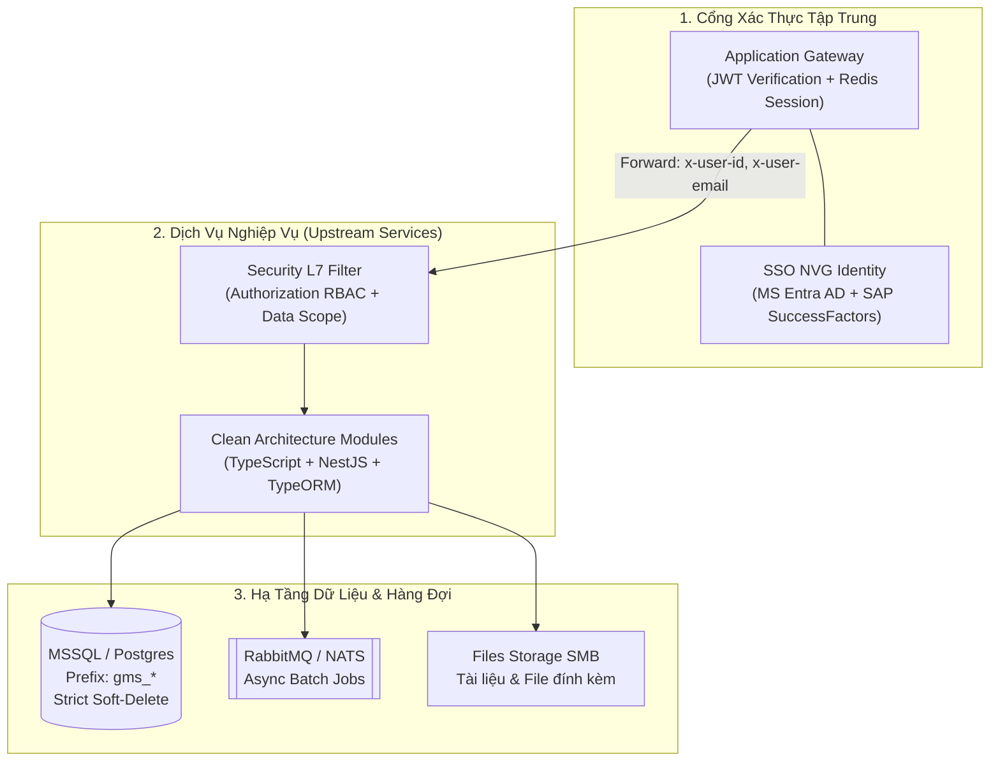

# Dev Architecture Spine & Technical Baseline Skill (2026)

Skill này cung cấp bộ khung chuẩn hóa kỹ thuật và checklist kiểm định (Architectural Sanity Check) giúp IT BA đảm bảo mọi tài liệu đặc tả nghiệp vụ (BRD, SRS, Use Cases, User Stories, API Contracts, Data Dictionary, UAT Test Cases) đều tương thích 100% với hạ tầng và kiến trúc phát triển phần mềm chuẩn của Tập đoàn NVG.

---

## 🎯 Khi Nào Kích Hoạt (Skill Triggers)
Skill này được kích hoạt khi:
- Lập mới hoặc rà soát tài liệu đặc tả: **BRD, URD, SRS, Use Case, User Story, API Contract, Data Dictionary**.
- Xác định phạm vi (Scope in/out) liên quan đến Xác thực (SSO / Login), Quản trị người dùng và Phân quyền.
- Thiết kế **Ma trận Phân quyền & Thẩm quyền (Authority Matrix - AM)** và phân định ranh giới **Data Scope** (phạm vi theo dự án/khu vực).
- Thiết kế cơ sở dữ liệu sơ bộ, Data Dictionary hoặc luồng Import/Export dữ liệu lớn (Excel).
- Đối chiếu (Gap Analysis) giữa tài liệu của BA với kiến trúc hệ thống (`ARCHITECTURE-SPINE.md` và `Architect-2026.png`).

---

## 🏛️ 7 Trụ Cột Kiến Trúc Dev Cốt Lõi (Architectural Spine Baseline)

### Chi tiết 7 Nguyên tắc:

| # | Trụ Cột Kiến Trúc | Quy Định Kỹ Thuật (Dev) | Ràng Buộc Đối Với BA Khi Viết Spec |
|:---:|---|---|---|
| **1** | **Xác thực & Danh tính (AuthN)** | `application-gateway` xử lý JWT, tích hợp MS Entra & SAP SF. Backend nhận `x-user-id`, `x-user-email`. | **Không thiết kế màn hình Login/Đổi mật khẩu**. Mọi người dùng đăng nhập bằng tài khoản Novagroup tập trung. |
| **2** | **Ma trận AM 2 Tầng (AuthZ)** | Security L7 tách biệt 2 lớp: Functional RBAC (Action/API) và Data Scope Filter. | Phân rã thẩm quyền: **Role ➔ Permission (Chức năng) + Data Scope (Được xem/sửa tại Dự án/Phân khu nào)**. Luôn gọi là **"Ma trận AM"**. |
| **3** | **Cơ sở dữ liệu & Entity** | TypeORM, MSSQL. Tên bảng có prefix `{prefix}_` (e.g. `gms_*`). Audit columns bắt buộc. | Data Dictionary & ERD sơ bộ bắt buộc dùng prefix `gms_`. Cấu trúc phân cấp tài sản: `Project ➔ Zone ➔ Block ➔ Floor ➔ Product`. |
| **4** | **Xóa Mềm (Soft-Delete)** | Cột `deletedAt`, `updatedBy`. Synchronize = false, Migration có up/down. | **100% Zero Hard-delete**. Use Case xóa phải quy định trạng thái ẩn, điều kiện khôi phục (restore) và vết kiểm toán (audit trail). |
| **5** | **Tính Bất Biến (Immutability)** | Không mutate object in-place. Lưu log phiên bản cho thực thể quan trọng. | Hợp đồng đã ký, biểu phí, chốt công nợ, hóa đơn **không được sửa đè**. Quy định cơ chế lập Phụ lục (Amendment) hoặc Version mới. |
| **6** | **API Contract Chuẩn** | Danh từ số ít: `.../v1/internal/{res}/{act}`. Envelope `{ ok, statusCode, statusMessage, data }`. | Khi viết spec giao tiếp API, tuân thủ đúng định dạng Response Envelope và danh từ số ít (ví dụ: `contract/create`, `product/list`). |
| **7** | **Xử Lý Bất Đồng Bộ (Async)** | Queue RabbitMQ & NATS. KEDA scale worker. Đẩy alert qua Teams/Email. | Import Excel > 100 dòng, tính tiền thuê định kỳ, xuất PDF hàng loạt phải thiết kế theo luồng Async (Pending ➔ Worker ➔ Thông báo kết quả). |

---

## 📋 Checklist 7 Điểm Đối Chiếu Kiến Trúc (Architecture Alignment Checklist)

Trước khi nghiệm thu bất kỳ tài liệu BA nào trong `docs/outputs/`, Agent và BA thực hiện kiểm tra 7 điểm sau:

- [ ] **1. Auth Scope**: Không có bất kỳ use case nào yêu cầu làm màn hình login, register, forgot password cho user nội bộ.
- [ ] **2. AM & Data Scope**: Đã tách bạch rõ Functional Permission và Data Scope (Dự án/Phân khu được thao tác). Sử dụng đúng thuật ngữ "AM".
- [ ] **3. Entity Hierarchy**: Cấu trúc dữ liệu bất động sản tuân thủ đúng thứ tự: Dự án (Project) ➔ Phân khu (Zone) ➔ Tháp/Khối (Block) ➔ Tầng (Floor) ➔ Mặt bằng/Sản phẩm (Product).
- [ ] **4. Database Prefix**: Toàn bộ tên bảng tham chiếu trong spec đều có tiền tố chuẩn (e.g. `gms_*`).
- [ ] **5. Soft-Delete Specification**: Mọi hành động "Xóa" đều được mô tả là chuyển trạng thái (soft-delete), lưu vết thời gian và người xóa, có cơ chế khôi phục.
- [ ] **6. Async Job Specs**: Các tác vụ nặng (nhập dữ liệu hàng loạt, tính toán tiền thuê chu kỳ) có đặc tả trạng thái hàng đợi và thông báo kết quả.
- [ ] **7. Storage & Notifications**: File đính kèm quy định lưu trữ tập trung; luồng phê duyệt trọng yếu có kênh cảnh báo qua MS Teams / Email.
