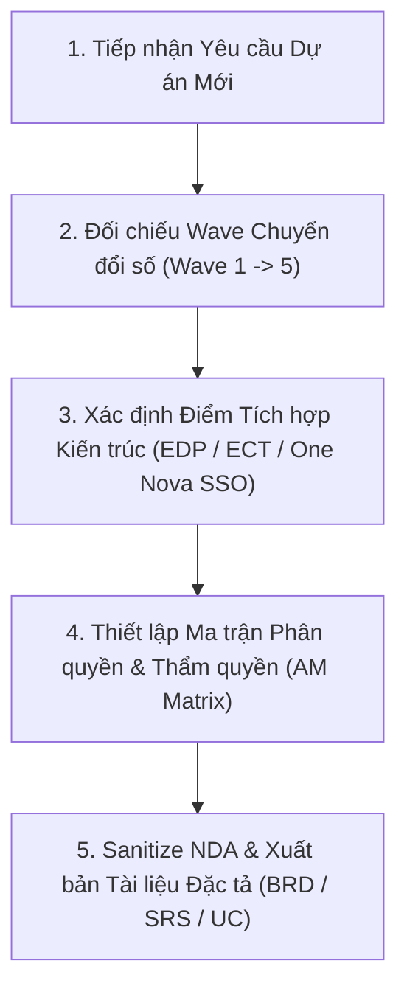

# Digital Transformation & Enterprise Architecture Baseline Skill

Skill này cung cấp tri thức nền tảng (Context Baseline & Architectural RAG) cho Agent và IT BA khi tiếp nhận, phân tích hoặc xây dựng tài liệu nghiệp vụ cho dự án mới trong Tập đoàn.

---

## 🎯 Khi Nào Sử Dụng (Skill Triggers)
Skill này được kích hoạt khi:
- Nhận yêu cầu phân tích dự án mới, viết **BRD / URD / SRS / Use Case / User Story / UAT Test Plan**.
- Cần đối chiếu tính tương thích kiến trúc của dự án với Lộ trình 5 Wave Chuyển đổi số 2025–2030.
- Cần định hình mô hình phân quyền **Ma trận AM (Approval Matrix)** hoặc luồng tích hợp dữ liệu với **Enterprise Data Platform (EDP)** / **Enterprise Control Tower (ECT)**.
- Thiết kế luồng nghiệp vụ liên quan đến **Employee Journey 12 bước** hoặc **Cơ chế Phân rã KPI / OKR** trên nền tảng **One Nova**.

---

## 📚 Tra Cứu Tài Liệu Chi Tiết (RAG Resources)

Khi cần thông tin chuyên sâu từng mảng, Agent tra cứu trực tiếp các file tài liệu đính kèm trong skill:

| Mảng Tri Thức | Path Tài Liệu | Nội Dung Chính |
|---|---|---|
| **Kiến trúc Công nghệ & Dữ liệu** | `resources/architecture_blueprint.md` | 5 Tầng Kiến trúc, EDP Lakehouse (Bronze/Silver/Gold), ECT Command Center, ESB/API Gateway. |
| **Mô hình Vận hành IT & Task-Force** | `resources/operating_model.md` | Mô hình IT-as-a-Business, Chu trình giao việc 6 bước với 6 Task-Forces, SLA & Chargeback. |
| **Nền tảng One Nova & Employee Journey** | `resources/one_nova_platform.md` | Employee Journey 12 bước, Cascade KPI Trọng số 100%, Phân quyền AM (Approval Matrix). |

---

## 🚀 Quy Trình BA Bắt Buộc Khi Tiếp Nhận Dự Án Mới (5-Step Check)

### Checklist 5 Bước:
1. **Phân vị Lộ trình Wave**: Giải pháp/Dự án thuộc Wave mấy? (Wave 1: Chuẩn hóa/ERP | Wave 2: EDP/Tích hợp CRM | Wave 3: Predictive/AI Copilots | Wave 4: Hyper-Automation | Wave 5: AI-Native).
2. **Kiến trúc Dữ liệu EDP**: Dữ liệu phát sinh từ dự án sẽ đẩy về tầng nào của EDP (Raw/Bronze, Cleansed/Silver, hay Business Ready/Gold)?
3. **Trung tâm Điều hành ECT**: Các chỉ số KPI/Performance nào của dự án cần đẩy lên Dashboard thời gian thực của ECT cho BOM/C-Level?
4. **Chuẩn hóa Phân quyền AM**: Đảm bảo Ma trận Phân quyền & Thẩm quyền phê duyệt (AM) tuân thủ đúng định dạng bảng AM chuẩn NVG.
5. **Tuân thủ NDA**: Chạy bộ lọc `enterprise-nda-sanitizer` trước khi lưu tài liệu vào workspace.
