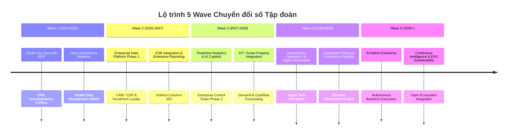

# ENTERPRISE ARCHITECTURE & DATA PLATFORM BLUEPRINT (2025 - 2030)

## 1. PHÂN HOẠCH 5 TẦNG KIẾN TRÚC TỔNG THỂ

### Tầng 1: Hệ thống Vận hành & Chuyên biệt (Operation & Specialized Platforms)
- **Quy trình Nghiệp vụ**: Đấu thầu & Cung ứng (Procurement), e-Office (Số hóa quy trình văn bản & trình ký), BIM (Xây dựng/BĐS), AI & An ninh chuyên biệt.
- **Vai trò**: Nơi phát sinh các giao dịch tác nghiệp hàng ngày của các Đơn vị / Phòng ban.

### Tầng 2: Trung tâm Điều hành Quản trị Tập trung (Enterprise Control Tower - ECT)
- **Chức năng**:
  - Giám sát tiến độ dự án toàn hệ thống thời gian thực.
  - Quản trị chỉ số tài chính, dòng tiền (Cashflow), doanh thu từ Tập đoàn xuống cơ sở.
  - Cảnh báo rủi ro sớm, theo dõi KPI hiệu suất làm việc & giải phóng mặt bằng.
- **Giao diện**: Mobile-First Dashboard hỗ trợ BOD & C-Level ra quyết định tức thì.

### Tầng 3: Hệ thống Lõi Doanh nghiệp (Core Platforms)
- **SAP ERP / D365**: Quản trị nguồn lực doanh nghiệp (Tài chính, Kế toán, Mua sắm, Kho vận).
- **SAP SuccessFactors**: Quản trị nhân sự & trải nghiệm nhân viên toàn diện.
- **CRM / CDP & Loyalty (NovaPoint)**: Quản trị quan hệ khách hàng, hệ sinh thái tích điểm & chăm sóc khách hàng tập trung.

### Tầng 4: Nền tảng Dữ liệu Tập trung (Enterprise Data Platform - EDP / Lakehouse)
- **Kiến trúc Delta Lakehouse 4 Tầng**:
  1. **Bronze (Raw Zone)**: Dữ liệu thô nguyên bản từ ERP, CRM, Apps, Web, IoT, POS.
  2. **Silver (Cleansed Zone)**: Dữ liệu đã làm sạch, chuẩn hóa schema, hợp nhất MDM.
  3. **Gold (Business Ready Zone)**: Dữ liệu tinh gọn, tính toán sẵn chỉ số (Business Aggregates), phục vụ báo cáo & AI.
  4. **Data Products / Consumption**: Cung cấp dữ liệu cho ECT, PowerBI, AI/ML Models.
- **Data Governance**: Phân quyền chi tiết (RBAC/Row-level security), giám sát Data Quality & Data Lineage tự động qua Unity Catalog / Purview.

### Tầng 5: Hệ thống Mở & Đối tác (Partner Ecosystems)
- **Đối tác & Nhà cung cấp**: Cổng thông tin Nhà cung cấp, B2B Connectors.
- **Khách hàng & Cư dân**: Cổng dịch vụ cư dân, App tiện ích số, Khách hàng thành viên.
- **Tài chính & Ngân hàng**: Tích hợp Open Banking, Ngân hàng liên kết & Ví điện tử.

---

## 2. LỘ TRÌNH 5 WAVE CHUYỂN ĐỔI SỐ (2024 - 2030+)

