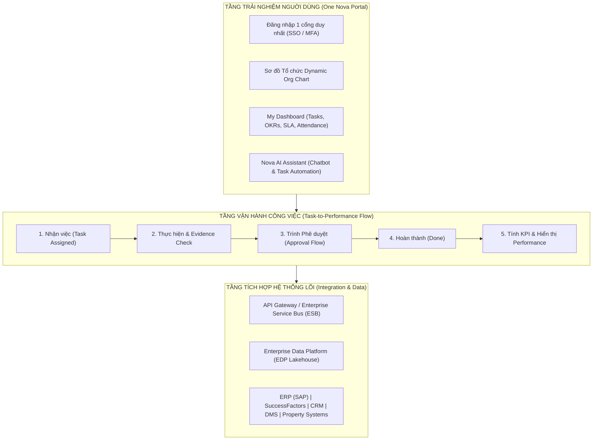
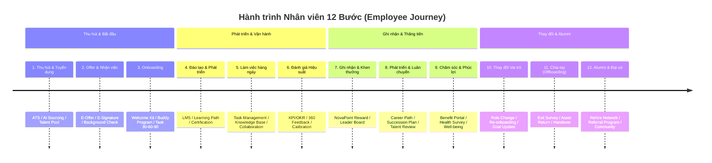

# ONE NOVA PLATFORM & EMPLOYEE JOURNEY SPECIFICATION

## 1. NỀN TẢNG THỰC THI NGHIỆP VỤ TẬP TRUNG ONE NOVA

One Nova là Cổng Quản trị & Vận hành Tập trung (Enterprise Operating System) duy nhất cho toàn thể cán bộ nhân viên Tập đoàn, tích hợp **SSO (Single Sign-On)**, **Org Chart**, **Personal Dashboard**, **AI Copilot**, và **Task-to-Performance Engine**.

---

## 2. CHUẨN HOÁ EMPLOYEE JOURNEY 12 BƯỚC

Mọi hệ thống Quản trị Nhân sự & Vận hành Công việc phải kết nối nhất quán theo hành trình 12 bước của Nhân viên:

---

## 3. CƠ CHẾ PHÂN RÃ KPI CASCADE & MA TRẬN PHÂN QUYỀN / THẨM QUYỀN (AM)

### 3.1 Quy tắc Cascade KPI
- Target chỉ số AOP (Annual Operating Plan) từ Tập đoàn được phân rã tuần tự xuống các cấp:  
  `Cấp Tập đoàn` $\rightarrow$ `Cấp TCT/BU` $\rightarrow$ `Cấp Khối/Ban` $\rightarrow$ `Cấp Phòng/Trung tâm` $\rightarrow$ `Cấp Nhóm/Team` $\rightarrow$ `Cấp Cá nhân`.
- **Nguyên tắc Ràng buộc Trọng số**: Tổng trọng số KPI của các mục tiêu tại bất kỳ cấp nào **phải tròn 100%**.

### 3.2 Quy chuẩn Ma trận Phân quyền & Thẩm quyền (Authority Matrix - AM)
Mọi tài liệu thiết kế hệ thống, SRS và Use Case trên One Nova bắt buộc phải định nghĩa **Bảng AM (Authority Matrix)** thay thế cho khái niệm phân quyền thông thường:

| Vai trò / Chức danh | Hạn mức Thẩm quyền Phê duyệt | Quyền Thao tác trên System | Luồng Ủy quyền / Thay thế |
|---|---|---|---|
| **Trưởng Ban / GĐ Khối** | Phê duyệt ngân sách/hợp đồng > 1 tỷ VNĐ | Create, Approve, Reject, Delegate | Ủy quyền cho Phó Ban khi Vắng mặt |
| **Trưởng Phòng / Team Lead** | Phê duyệt task/ngân sách < 1 tỷ VNĐ | Create, Review, Approve Task | Ủy quyền Senior BA / Senior Dev |
| **Chuyên viên / BA / Dev** | Thực thi tác nghiệp chuyên môn | Create Task, Submit Evidence, Update Status | N/A |
