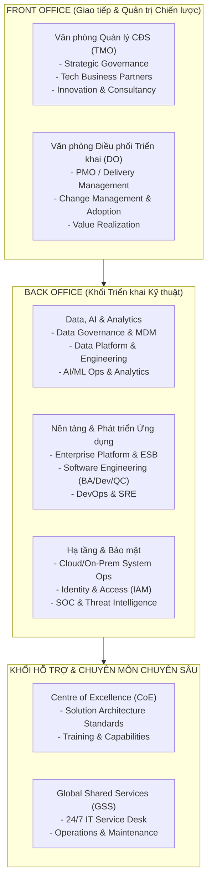
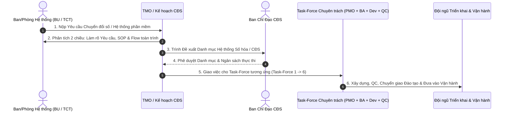

# OPERATING MODEL & TASK-FORCE INTERACTION FRAMEWORK

## 1. MÔ HÌNH VẬN HÀNH IT-AS-A-BUSINESS

Trung tâm Công nghệ (TTCN) được tổ chức theo mô hình đơn vị dịch vụ chuyên nghiệp, phân tách rõ ràng giữa **Quản trị Chiến lược (Front Office)**, **Khối Triển khai Kỹ thuật (Back Office)** và **Dịch vụ Chia sẻ (Shared Services)**:

---

## 2. QUY TRÌNH 6 BƯỚC INTERACTION GIỮA BUSINESS VÀ TTCN

Nhu cầu chuyển đổi số từ các Ban/Phòng/TCT nghiệp vụ được tiếp nhận và xử lý qua **6 Task-Forces chuyên trách** (Finance/Investment, Procurement, Operations/GMS, HR/RPC, Sales/Marketing, Security/Digital Library):

---

## 3. CƠ CHẾ NGÂN SÁCH VÀ THỎA THUẬN DỊCH VỤ (SLA & CHARGEBACK)

1. **Tổng Ngân sách CNTT**: Xây dựng dựa trên Kế hoạch Ngân sách Hàng năm (AOP) / Kế hoạch Dài hạn (LTP) ở mức Consolidation Tập đoàn.
2. **Chi phí Triển khai Dự án mới**: Tính theo dự toán ngân sách thực tế + Thỏa thuận SLA phê duyệt theo từng yêu cầu.
3. **Chi phí Vận hành Hàng ngày (BAU)**: Chargeback cho các TCT/BU theo thỏa thuận mức dịch vụ (SLA) dựa trên tỷ lệ % phân bổ hoặc Chi phí Thực tế + Mark-up chuẩn.
