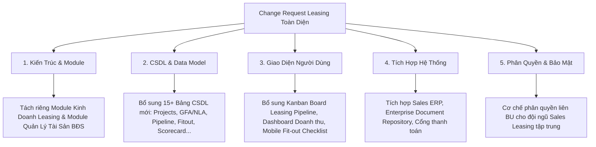

# BÁO CÁO PHÂN TÍCH KHOẢNG TRỐNG & ĐÁNH GIÁ TÁC ĐỘNG (GAP & IMPACT ANALYSIS)
## PHÂN HỆ: QUẢN LÝ BẤT ĐỘNG SẢN CHO THUÊ (COMMERCIAL LEASING MANAGEMENT)
> **Tài liệu căn cứ AS-IS:** Hợp đồng & URD GMS (Mã tham chiếu `REF-GMS-2026`)  
> **Tài liệu đề xuất Change Request (CR):** Phiếu yêu cầu phát triển ứng dụng Leasing (Mã tham chiếu `REF-CR-2026`)  
> **Đơn vị yêu cầu CR:** Khối Kinh doanh Cho thuê Thương mại (**RetailLease**) & Khối Quản lý Tài sản BĐS (**AssetMgmt**)  
> **Thời điểm yêu cầu CR:** Tháng 09/2026  
> **Quy chuẩn bảo mật:** Tuân thủ `enterprise-nda-sanitizer` (Generalize by Default)  
> **Chuyên viên phân tích (BA):** AI Business Analyst Agent · BA Zone Toolkit  

---

## 1. BẢN CHẤT CỦA BẢN CHANGE REQUEST (CR CONTEXT & DRIVERS)

### 1.1. Xuất phát điểm và động lực thay đổi
Trong tài liệu URD GMS ban đầu, Phân hệ Quản lý Cho thuê (Leasing Management) được thiết kế chủ yếu dưới góc nhìn của **Ban Quản lý Tòa nhà / Cơ sở vận hành (Property Management - PM)**:
- Tập trung vào quản lý mặt bằng đã hiện hữu, theo dõi việc bàn giao hiện trạng, bảo trì mặt bằng, thu tiền thuê và xử lý công nợ.
- Thậm chí URD cũ còn ghi chú: *"PM chịu trách nhiệm upload hồ sơ pháp lý, không phải đơn vị kinh doanh leasing"*.

Tuy nhiên, trong bản Yêu cầu Phát triển Ứng dụng mới, **Khối Kinh doanh Cho thuê (RetailLease)** cùng **Khối Quản lý Tài sản (AssetMgmt)** của Tập đoàn đã chính thức đệ trình yêu cầu nhằm **tái định nghĩa hoàn toàn phạm vi phân hệ Leasing**:
- Hiện trạng thực tế tại đơn vị: Chưa có phần mềm chuyên dụng, toàn bộ quy trình đang quản lý thủ công qua bảng tính Excel, Word và PDF lưu trữ trên kho dữ liệu phân tán (Legacy DMS Portal).
- RetailLease và AssetMgmt là 2 đơn vị kinh doanh cốt lõi chịu trách nhiệm về toàn bộ **Doanh thu khai thác thương mại** và **Hiệu quả danh mục tài sản BĐS** của toàn hệ thống.
- Do đó, CR này chuyển dịch trọng tâm của GMS Leasing: từ một công cụ *"Hậu kiểm vận hành tòa nhà"* trở thành một **Nền tảng Quản lý Danh mục BĐS & Phễu Kinh Doanh Cho Thuê Chuyên Nghiệp (Commercial Real Estate Portfolio & Leasing CRM)**.

---

## 2. BẢNG SO SÁNH TỔNG THỂ: AS-IS (URD GMS) VS TO-BE (CR MỚI)

```mermaid
graph TD
    subgraph AS_IS[URD GMS Cũ - Góc nhìn Vận hành PM]
        M1[BĐS Đã Có Sẵn] --> M2[Hợp Đồng Thuê]
        M2 --> M3[Vận Hành & Bảo Trì]
        M3 --> M4[Thu Tiền & Công Nợ]
    end

    subgraph TO_BE[CR Mới - Góc nhìn Đầu tư & Kinh doanh RetailLease / AssetMgmt]
        P1[Lưới Dự Án Pipeline CĐT] --> P2[Quy Hoạch Layout GFA/NLA]
        P2 --> P3[Phương Án Khai Thác ROE/ROI]
        P3 --> P4[Leasing Pipeline & Chào Thuê]
        P4 --> P5[Đàm Phán & Chốt Deal Cọc]
        P5 --> P6[Hợp Đồng & Quản Lý Thi Công Fit-out]
        P6 --> P7[Khai Trương & Vận Hành Doanh Thu]
        P7 --> P8[Đánh Giá Xếp Hạng Khách Thuê]
        P8 --> P9[Thu Hồi & Tái Khai Thác / Tái Định Vị]
    end
```

| Tiêu chí so sánh | Hiện trạng AS-IS (URD GMS Ban Đầu) | Đề xuất mới TO-BE (CR Leasing Toàn Diện) | Mức độ thay đổi (Delta) |
|---|---|---|:---:|
| **1. Chủ thể nghiệp vụ (Key Stakeholders)** | Ban Quản lý Tòa nhà (PM), Kế toán cơ sở, Khách thuê. | **Khối Kinh doanh Leasing (RetailLease)**, **Khối Quản lý Tài sản (AssetMgmt)**, Chủ đầu tư (CĐT), Đội ngũ Sales Leasing, Khách thuê chuỗi. | 🔴 **Thay đổi lớn** |
| **2. Phạm vi vòng đời tài sản** | Quản lý mặt bằng đã hình thành, trạng thái Trống/Đang thuê. | Quản lý xuyên suốt từ **Dự án Pipeline CĐT $\rightarrow$ Quy hoạch GFA/NLA $\rightarrow$ Đánh giá tiềm năng $\rightarrow$ Tái khai thác / Tái định vị**. | 🔴 **Mới hoàn toàn** |
| **3. Phễu kinh doanh (Leasing Pipeline)** | Không có. Chỉ tiếp nhận khi đã có yêu cầu thuê để đàm phán hợp đồng. | Quản lý toàn diện: **Lead $\rightarrow$ Khảo sát on-site $\rightarrow$ Proposal $\rightarrow$ Đàm phán $\rightarrow$ Báo cáo chốt khách $\rightarrow$ Đặt cọc**. | 🔴 **Mới hoàn toàn** |
| **4. Quy hoạch diện tích & Layout** | Chỉ lưu diện tích tim tường, diện tích thông thủy ($m^2$). | Quản lý chỉ số quy hoạch thương mại: **GFA** (Tổng diện tích sàn), **NLA** (Diện tích cho thuê thuần), phân luồng giao thông, tiện ích dùng chung. | 🟡 **Nâng cấp sâu** |
| **5. Phân tích tài chính & Khả thi** | Bảng giá thuê cố định hoặc theo $m^2$, kế hoạch doanh thu. | Xây dựng phương án khai thác tài sản, đánh giá chỉ số tài chính đầu tư (**ROE, ROI**), quy hoạch ngành hàng tối ưu (Tenant Mix). | 🔴 **Mới hoàn toàn** |
| **6. Giai đoạn Fit-out & Khai trương** | Bàn giao mặt bằng $\rightarrow$ chuyển thẳng sang vận hành. | Quản lý thủ tục thi công, **tiến độ Fit-out**, nghiệm thu hoàn thiện, mốc **Khai trương chính thức (Grand Opening)**, tự động cảnh báo chậm khai trương. | 🔴 **Mới hoàn toàn** |
| **7. Quản trị quan hệ khách thuê** | Lưu thông tin cá nhân/pháp nhân, MST, lịch sử hợp đồng. | **Hệ thống đánh giá & xếp hạng khách thuê (Tenant Scoring/Tiering)**, theo dõi chuỗi/thương hiệu, quản lý kế hoạch mở rộng chi nhánh. | 🟡 **Nâng cấp sâu** |
| **8. Quản lý năng suất đội ngũ Leasing** | Chỉ có KPI chung của nhân sự. | **Quản lý năng suất lao động đội Sales Leasing**: phân bổ Lead/dự án, đo lường tỷ lệ chuyển đổi, khối lượng cuộc gọi/khảo sát thực địa. | 🔴 **Mới hoàn toàn** |
| **9. Tích hợp hệ thống** | Phần mềm kế toán nội bộ, CRM rời rạc. | Đồng bộ **Sales ERP System** (Ban Kinh doanh), **Financial Accounting System**, tích hợp **Enterprise Document Repository**, thay thế hệ thống Legacy DMS. | 🟡 **Nâng cấp** |

---

## 3. PHÂN RÃ CHI TIẾT 7 QUY TRÌNH MỚI TINH TRONG BẢN CR

### Quy trình 1: Quản lý Danh mục Dự án (Project Pipeline Management)
- **Điểm mới:** RetailLease/AssetMgmt tiếp nhận thông tin dự án ngay từ giai đoạn Chủ đầu tư (CĐT) lập quy hoạch.
- **Tính năng cần phát triển:**
  1. *Pipeline Dự án*: Quản lý lưới các dự án chuẩn bị triển khai, mốc bàn giao dự kiến từ CĐT.
  2. *Quy hoạch thương mại*: Bóc tách cơ cấu diện tích GFA (Gross Floor Area) và NLA (Net Lettable Area) theo từng tầng, phân khu chức năng; xác định luồng giao thông tiếp cận, bãi đỗ xe, tiện ích đi kèm.
  3. *Theo dõi điều kiện khai thác*: Kiểm soát tiến độ hoàn thiện pháp lý xây dựng, hạ tầng cơ sở; phê duyệt mốc **"Dự án sẵn sàng đưa vào khai thác"**.

### Quy trình 2: Quản lý Vòng đời Bất động sản (Real Estate Asset Lifecycle)
- **Điểm mới:** Bổ sung tư duy quản trị tài sản đầu tư (Asset Management) thay vì chỉ quản lý cơ sở vật chất (Facility Management).
- **Tính năng cần phát triển:**
  1. *Đánh giá tiềm năng*: Khảo sát vị trí, công năng, thị trường, đối thủ cạnh tranh, phân khúc khách hàng.
  2. *Phương án khai thác*: Tính toán bài toán hiệu quả tài chính (**ROE, ROI**, thời gian hoàn vốn), xác định cơ cấu ngành hàng (F&B, Thời trang, Tiện ích, Dịch vụ...).
  3. *Tái khai thác & Tái định vị (Asset Repositioning)*: Khi hợp đồng kết thúc hoặc thị trường biến động, hệ thống hỗ trợ quy trình đánh giá lại giá trị mặt bằng, lập phương án cải tạo/tái đầu tư để chào thuê chu kỳ tiếp theo.

### Quy trình 3: Quy trình Quản lý Cho thuê & Phễu Bán Hàng (Leasing Sales Pipeline)
- **Điểm mới:** Xây dựng module CRM B2B chuyên biệt cho mảng BĐS thương mại.
- **Tính năng cần phát triển:**
  1. *Chuẩn bị sản phẩm chào thuê*: Đóng gói thông tin mặt bằng, sơ đồ layout, hình ảnh, tài liệu marketing kit để nhân viên kinh doanh gửi khách.
  2. *Sàng lọc Lead*: Tiếp nhận nhu cầu, đánh giá độ phù hợp của thương hiệu với định hướng quy hoạch ngành hàng.
  3. *Quản lý Khảo sát & Proposal*: Theo dõi lịch dẫn khách đi xem mặt bằng, gửi bản chào giá/điều kiện thuê (Leasing Proposal).
  4. *Báo cáo chốt khách thuê (Deal Closing Report)*: Lập hồ sơ tổng hợp kết quả đàm phán thương mại (giá, cọc, thời gian miễn tiền thuê/fit-out), trình cấp có thẩm quyền phê duyệt trước khi soạn thảo hợp đồng.
  5. *Xác nhận tiền đặt cọc (Deposit Confirmation)*: Kiểm soát việc khách nộp tiền giữ chỗ/đặt cọc trước khi kích hoạt quy trình hợp đồng.

### Quy trình 4: Quản lý Thi công Fit-out & Khai Trương (Fit-out & Grand Opening)
- **Điểm mới:** Giải quyết "vùng trũng" giữa lúc ký hợp đồng đến lúc khách chính thức mở cửa kinh doanh.
- **Tính năng cần phát triển:**
  1. *Hướng dẫn thủ tục thi công*: Cung cấp quy chế thi công, tiếp nhận bản vẽ thiết kế fit-out từ khách thuê, điều phối BQL tòa nhà duyệt phương án thi công.
  2. *Theo dõi tiến độ thi công*: Giám sát thực tế các mốc xây dựng, cải tạo của khách thuê.
  3. *Nghiệm thu & Khai trương*: Xác nhận hoàn thành thi công, ghi nhận ngày khai trương thực tế vs ngày khai trương cam kết; **phát cảnh báo các trường hợp khách thuê chậm khai trương** gây ảnh hưởng đến doanh thu và hoạt động chung của trung tâm.

### Quy trình 5: Đánh giá, Phân Nhóm & Xếp Hạng Khách Thuê (Tenant Scoring & Rating)
- **Điểm mới:** Chuyển từ quản lý thông tin tĩnh sang đánh giá động giá trị vòng đời khách thuê.
- **Tính năng cần phát triển:**
  1. *Hồ sơ thương hiệu chuỗi*: Quản lý mạng lưới chi nhánh, nhận diện thương hiệu, quy mô chuỗi.
  2. *Chấm điểm khách thuê (Tenant Scorecard)*: Tính điểm dựa trên các tiêu chí: Lịch sử thanh toán đúng hạn, Mức độ tuân thủ nội quy vận hành, Doanh thu/hiệu quả kinh doanh, Tiềm năng mở rộng hợp tác.
  3. *Phân hạng khách hàng (VIP/Chiến lược/Tiềm năng/Rủi ro)*: Căn cứ để Ban Giám đốc phê duyệt chính sách ưu đãi giá khi gia hạn, ưu tiên phân bổ mặt bằng đắc địa hoặc áp dụng biện pháp phòng ngừa rủi ro nợ xấu.

### Quy trình 6: Quản lý Năng Suất Lao Động Đội Ngũ Leasing (Leasing Team Productivity)
- **Điểm mới:** Giám sát và thúc đẩy hiệu suất làm việc của chuyên viên kinh doanh cho thuê.
- **Tính năng cần phát triển:**
  1. *Thiết lập KPI đa chiều*: Giao chỉ tiêu theo tháng/quý về Doanh thu, Diện tích cho thuê ($m^2$), Số lượng Lead mới, Số lượt khảo sát thực tế, Số Proposal phát hành, Số Hợp đồng ký mới.
  2. *Phân bổ tài sản & Khách hàng*: Gán quyền phụ trách từng dự án/mặt bằng cho từng nhân sự Leasing.
  3. *Đo lường năng suất & Tỷ lệ chuyển đổi*: Dashboard thể hiện tỷ lệ chuyển đổi qua từng bước của phễu (Lead $\rightarrow$ Khảo sát $\rightarrow$ Proposal $\rightarrow$ HĐ); đo lường thời gian xử lý trung bình của từng nhân sự.

### Quy trình 7: Hệ Thống Biểu Mẫu Chuẩn & Tích Hợp Chuyên Sâu
- **Biểu mẫu nghiệp vụ chuẩn hóa:**
  * Checklist điều kiện mặt bằng sẵn sàng khai thác.
  * Mẫu Proposal/Chào giá chuẩn.
  * Biên bản bàn giao & hoàn trả mặt bằng.
  * Checklist theo dõi thi công/nghiệm thu fit-out.
  * Thư đề nghị thanh toán / Thông báo công nợ chuẩn mẫu.
- **Tích hợp hệ thống:**
  * Đồng bộ 2 chiều với **Sales ERP System** (Ban Kinh doanh).
  * Đồng bộ công nợ với **Financial Accounting System**.
  * Tích hợp kho lưu trữ **Enterprise Document Repository** để đồng bộ hồ sơ hợp đồng, bản vẽ kỹ thuật.

---

## 4. ĐÁNH GIÁ TÁC ĐỘNG HỆ THỐNG (SYSTEM IMPACT ANALYSIS)

### 4.1. Tác động đến Kiến trúc Phần mềm (Architecture Impact)
- **Trước CR**: Phân hệ Leasing nằm trong khối dịch vụ vận hành chung của GMS (cùng cấp với Kỹ thuật, Housekeeping, Cảnh quan).
- **Sau CR**: Cần cấu trúc lại Leasing Management thành một **Sub-system độc lập** bao gồm 3 phân hệ con:
  1. *Asset & Portfolio Management* (Quản lý Danh mục Dự án, Mặt bằng & Quy hoạch GFA/NLA - phục vụ AssetMgmt).
  2. *Leasing CRM & Sales Pipeline* (Phễu bán hàng, Chào giá, Đàm phán, Hợp đồng & KPI nhân sự - phục vụ RetailLease).
  3. *Leasing Operation & Fit-out* (Bàn giao, Giám sát thi công, Khai trương, Vận hành & Công nợ - phối hợp RetailLease, AssetMgmt và PM).

### 4.2. Tác động đến Cơ sở Dữ liệu (Database Schema Impact)
Hệ thống cần bổ sung tối thiểu các thực thể dữ liệu mới:
- `Projects` & `Project_Pipelines`: Quản lý dự án từ CĐT, tiến độ chuẩn bị.
- `Asset_Master_Plans`: Quy hoạch layout, GFA, NLA, phân khu chức năng.
- `Asset_Commercial_Evaluations`: Đánh giá tiềm năng, chỉ số ROE, ROI.
- `Leasing_Leads` & `Leasing_Opportunities`: Quản lý khách hàng tiềm năng và phễu đàm phán.
- `Leasing_Proposals` & `Deal_Closing_Reports`: Quản lý bản chào giá và báo cáo chốt khách.
- `Fitout_Projects` & `Fitout_Checklists`: Quản lý quá trình thi công và nghiệm thu khai trương.
- `Tenant_Scorecards` & `Tenant_Rankings`: Chấm điểm và phân hạng khách thuê.
- `Leasing_Agent_KPIs` & `Leasing_Activities`: Giao chỉ tiêu và ghi nhận hoạt động sales.

### 4.3. Tác động đến Giao diện & Trải nghiệm Người dùng (UI/UX Impact)
- **Web Portal**:
  * Bổ sung màn hình **Kanban Board** trực quan cho *Leasing Pipeline* (kéo thả deal từ Lead $\rightarrow$ Khảo sát $\rightarrow$ Proposal $\rightarrow$ HĐ $\rightarrow$ Fitout $\rightarrow$ Khai trương).
  * Dashboard quản trị hiệu suất kinh doanh cho Ban Giám đốc Khối Kinh doanh và Quản lý Tài sản.
  * Màn hình tra cứu tương tác dòng thời gian (Timeline View) cho từng khách thuê/thương hiệu chuỗi.
- **Mobile App**:
  * Bổ sung tính năng cho chuyên viên Leasing: Tra cứu nhanh giỏ hàng mặt bằng trống on-site, check-in dẫn khách đi khảo sát mặt bằng, tạo nhanh lead mới.
  * Bổ sung tính năng cho giám sát kỹ thuật: Checklist nghiệm thu fit-out tại công trường, chụp ảnh tiến độ thi công.

### 4.4. Tác động đến Phân quyền & Mô hình Vận hành (RBAC & Governance)
- Phá vỡ ranh giới "Dữ liệu chỉ nằm trong 1 cơ sở": Đội ngũ kinh doanh của RetailLease là **lực lượng bán hàng tập trung**, họ có quyền xem giỏ hàng và chào thuê chéo giữa nhiều dự án/BU khác nhau trên toàn hệ thống.
- Thiết lập quy trình phê duyệt đa cấp (**Approval Workflow Engine**): Đề xuất giá thuê $\rightarrow$ Trưởng phòng Leasing duyệt $\rightarrow$ Giám đốc Khối Leasing phê duyệt $\rightarrow$ Ban Quản lý tài sản (AssetMgmt) xác nhận.

---

## 5. KẾT LUẬN & ĐỀ XUẤT LỘ TRÌNH TRIỂN KHAI (RECOMMENDED ROADMAP)

Bản Change Request của mảng Leasing là một **bước chuyển đổi chiến lược rất lớn**, giúp hệ thống từ một phần mềm vận hành kỹ thuật thuần túy trở thành hệ thống điều hành kinh doanh thương mại toàn diện.

### Đề xuất lộ trình triển khai 2 giai đoạn (Phased Delivery):
1. **Giai đoạn 1 (Core Leasing & Revenue Operations - Sprint 1-3)**:
   - Nâng cấp Quản lý Danh mục BĐS (bổ sung GFA, NLA, liên kết Dự án CĐT).
   - Chuẩn hóa Vòng đời Hợp đồng thuê đầy đủ (Đàm phán $\rightarrow$ Cọc $\rightarrow$ Ký $\rightarrow$ Bàn giao $\rightarrow$ Thu hồi).
   - Xây dựng module Quản lý Thi công Fit-out & Khai trương (đáp ứng cảnh báo trễ khai trương).
   - Tích hợp công nợ và hóa đơn với Financial Accounting System.
2. **Giai đoạn 2 (Leasing CRM & Asset Optimization - Sprint 4-6)**:
   - Xây dựng toàn diện phễu Leasing Pipeline (Kanban board Lead $\rightarrow$ Proposal $\rightarrow$ Deal Closing).
   - Module chấm điểm, xếp hạng khách thuê (Tenant Scorecard) và quản lý thương hiệu chuỗi.
   - Quản lý KPI và năng suất đội ngũ chuyên viên Leasing.
   - Tích hợp Sales ERP System và Enterprise Document Repository.

---
*(Báo cáo hoàn chỉnh được lưu tại [docs/CR_LEASING_GAP_ANALYSIS_REPORT.md](file:///d:/repo/ba-zone/docs/CR_LEASING_GAP_ANALYSIS_REPORT.md) phục vụ các phiên họp thẩm định kỹ thuật và điều chỉnh hợp đồng phần mềm)*.
