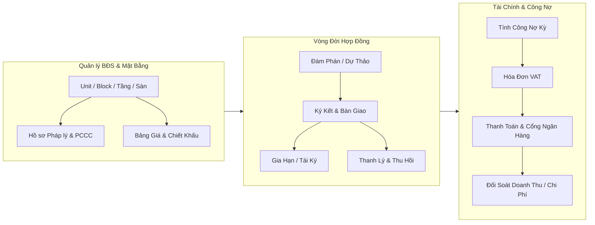
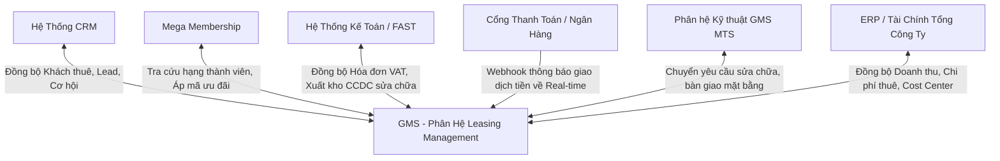

# BẢN TÓM TẮT HIỆN TRẠNG NGHIỆP VỤ (AS-IS SUMMARY)
## PHÂN HỆ: QUẢN LÝ BẤT ĐỘNG SẢN CHO THUÊ / ĐI THUÊ (LEASING MANAGEMENT)
> **Căn cứ tài liệu:** URD GMS Full Final (Mã định danh `REF-GMS-2026`, phê duyệt ngày 30/03/2026)  
> **Dự án:** GMS – General Management System (MegaCorp & TechPartner)  
> **Mục đích tài liệu:** Thiết lập bức tranh nghiệp vụ hiện trạng (AS-IS Baseline) để làm căn cứ phân tích, đánh giá tác động và thiết kế yêu cầu thay đổi (Change Request - CR).

---

## 1. TỔNG QUAN VÀ PHẠM VI NGHIỆP VỤ AS-IS

Phân hệ **Quản lý Bất động sản Cho thuê / Đi thuê (Leasing Management)** trong GMS đóng vai trò là trung tâm quản lý toàn bộ vòng đời khai thác kinh doanh mặt bằng, shophouse, sàn thương mại, kiosk, căn hộ dịch vụ và văn phòng trong hệ sinh thái Mega Service.

Phân hệ xử lý **02 mô hình vận hành song song**:
1. **Cho thuê (Leasing Out)**: MegaCorp sở hữu hoặc quản lý mặt bằng và cho khách thuê/đối tác thuê lại để kinh doanh hoặc lưu trú.
2. **Đi thuê lại (Sub-leasing / Leasing In)**: MegaCorp đi thuê mặt bằng/BĐS từ chủ sở hữu bên ngoài (hoặc các đơn vị thành viên), sau đó phân bổ chi phí thuê hoặc cải tạo cho thuê thứ cấp.



---

## 2. KIẾN TRÚC LUỒNG NGHIỆP VỤ AS-IS (END-TO-END WORKFLOWS)

### 2.1. Luồng 1: Quản lý Danh mục BĐS & Hồ sơ Pháp lý
- **Cấu trúc phân cấp tài sản BĐS**: Quản lý đa cấp từ `Dự án` $\rightarrow$ `Khu vực/Phân khu` $\rightarrow$ `Tòa nhà/Building/Block` $\rightarrow$ `Tầng` $\rightarrow$ `Mặt bằng chi tiết (Unit/Lot/Kiosk)`.
- **Thông số kỹ thuật mặt bằng**: Diện tích tim tường, diện tích thông thủy ($m^2$), vị trí định vị GPS, sơ đồ mặt bằng, hình ảnh hiện trạng, danh mục tài sản/thiết bị gắn liền với mặt bằng (điều hòa, hệ thống PCCC, đèn chiếu sáng, công tơ điện nước).
- **Hồ sơ pháp lý (HSPL)**:
  * Lưu trữ file scan: Sổ đỏ/GCN quyền sở hữu, giấy phép xây dựng, nghiệm thu PCCC, giấy chứng nhận VSATTP, hợp đồng gốc với chủ sở hữu.
  * *Quy định trách nhiệm:* Bộ phận Quản lý tòa nhà/cơ sở (**PM - Property Management**) chịu trách nhiệm upload và cập nhật HSPL (không phải NLE).
- **Máy trạng thái mặt bằng (Asset State Machine)**:
  ```text
  [Trống (Vacant)] ──> [Đang đàm phán (Reserved)] ──> [Đang cho thuê (Occupied)]
         ▲                                                      │
         │                                                      ▼
  [Chờ bàn giao] <── [Đang sửa chữa/Cải tạo] <── [Chấm dứt HĐ / Bàn giao lại]
  ```

---

### 2.2. Luồng 2: Quản lý Bảng giá & Kế hoạch Kinh doanh
- **Cấu hình bảng giá linh hoạt**:
  * Đơn giá thuê theo $m^2$/tháng hoặc giá thuê khoán trọn gói cố định.
  * Đơn giá bậc thang theo thời hạn thuê (năm 1, năm 2, năm 3...).
  * Phụ phí dịch vụ đi kèm: Phí quản lý vận hành, phí vệ sinh, an ninh, tiền điện/nước (tính theo chỉ số đồng hồ hoặc khoán).
- **Rule áp giá tự động & Ưu đãi**: Hệ thống tự động tính toán tổng giá trị hợp đồng dự kiến dựa trên diện tích mặt bằng và chính sách chiết khấu/ưu đãi của từng phân khúc khách hàng.
- **Kế hoạch cho thuê (Leasing Plan)**: Lập kế hoạch doanh thu mục tiêu, kế hoạch tỷ lệ lấp đầy theo từng tháng/quý cho từng BU/cơ sở.

---

### 2.3. Luồng 3: Khách thuê & Quản lý Vòng đời Hợp đồng (Contract Lifecycle)
- **Hồ sơ đối tác / Khách thuê**:
  * Khách hàng doanh nghiệp (pháp nhân): Tên công ty, MST, người đại diện, giấy phép ĐKKD, tài khoản ngân hàng.
  * Khách hàng cá nhân: Họ tên, CCCD/Hộ chiếu, thông tin liên hệ.
  * Lịch sử khách thuê: Liên kết danh sách tất cả các hợp đồng trong quá khứ và hiện tại; theo dõi lịch sử thanh toán, lịch sử vi phạm nội quy.
- **Giai đoạn 1: Tiếp nhận nhu cầu & Đàm phán**:
  * Tạo yêu cầu thuê $\rightarrow$ Ghi nhận lịch sử đàm phán giá, điều khoản thanh toán, thời gian thi công fit-out.
  * Chuẩn bị và lưu trữ các phiên bản hợp đồng dự thảo (Draft Contract Versioning).
- **Giai đoạn 2: Ký kết & Bàn giao**:
  * Tạo hợp đồng chính thức, lưu trữ file đính kèm và các phụ lục (PLHĐ).
  * Quy trình bàn giao mặt bằng: Checklist bàn giao hiện trạng tài sản, công tơ điện nước đầu kỳ, chụp ảnh trước-sau, lập và ký biên bản bàn giao điện tử.
- **Giai đoạn 3: Vận hành & Cảnh báo trong hạn hợp đồng**:
  * Tiếp nhận yêu cầu sửa chữa, bảo trì phát sinh từ khách thuê.
  * **Hệ thống cảnh báo tự động**:
    - Cảnh báo HĐ sắp hết hạn trước **90 ngày, 60 ngày, 30 ngày**.
    - Cảnh báo vi phạm nghĩa vụ thanh toán tiền thuê.
    - Cảnh báo bổ sung tiền đặt cọc (Deposit).
- **Giai đoạn 4: Gia hạn / Tái ký / Điều chỉnh**:
  * Đề xuất gia hạn hoặc điều chỉnh giá thuê, diện tích thuê.
  * Lưu vết lịch sử thay đổi điều khoản và phụ lục gia hạn.
- **Giai đoạn 5: Thanh lý & Thu hồi mặt bằng**:
  * Lập biên bản kiểm tra hiện trạng hoàn trả mặt bằng.
  * Khấu trừ chi phí hư hại, nợ tồn đọng vào tiền ký quỹ/đặt cọc.
  * Chuyển trạng thái mặt bằng về "Trống" hoặc "Đang sửa chữa".

---

### 2.4. Luồng 4: Tài chính, Công nợ, Hóa đơn & Đối soát
- **Tính toán công nợ kỳ**: Định kỳ hàng tháng/quý, hệ thống tự động sinh bảng kê công nợ (tiền thuê mặt bằng + phí dịch vụ + điện nước tiêu thụ).
- **Quản lý hóa đơn VAT**: Lưu trữ thông tin hóa đơn VAT, tích hợp đẩy dữ liệu sang hệ thống kế toán tài chính/ERP.
- **Tích hợp cổng thanh toán & Ngân hàng**: Hỗ trợ ghi nhận giao dịch thanh toán tự động, cập nhật trạng thái thanh toán theo thời gian thực (Real-time Payment Status).
- **Chi phí đi thuê lại (Sub-leasing Cost)**: Với các BĐS doanh nghiệp đi thuê từ chủ sở hữu ngoài để khai thác, hệ thống theo dõi nghĩa vụ chi phí phải trả chủ nhà, phân bổ chính xác theo từng mặt bằng và hợp đồng tương ứng.

---

### 2.5. Luồng 5: Dashboard Quản trị & Cảnh Báo Điều Hành
Dashboard của phân hệ Leasing tập trung vào 2 nhóm chỉ số trọng yếu:
1. **Tỷ lệ lấp đầy (Occupancy Metrics)**:
   - Tổng số lượng BĐS đang cho thuê / đi thuê.
   - Tổng số lượng BĐS đang trống.
   - Tỷ lệ lấp đầy hiện tại (%) và biến động tăng/giảm so với tháng trước.
2. **Doanh thu & Hiệu suất kinh doanh (Revenue & KPI Metrics)**:
   - Doanh thu thực tế lũy kế vs Doanh thu mục tiêu.
   - % Hoàn thành KPI doanh thu.
   - Dự báo doanh thu các tháng tiếp theo và phát cảnh báo nguy cơ không đạt KPI.
   - Đánh giá KPI hiệu suất nhân sự kinh doanh cho thuê.

---

## 3. BẢNG DANH MỤC TÍNH NĂNG AS-IS (FEATURE BREAKDOWN MATRIX)

Bảng tổng hợp đối chiếu trực tiếp từ Mục 6.4 (Trang 60 - 62 của URD):

| STT | Nhóm chức năng | Tên chức năng cụ thể | Mô tả hành vi hệ thống AS-IS |
|:---:|---|---|---|
| **1** | **Dashboard BĐS** | 1.1. Dashboard Tỷ lệ lấp đầy | Hiển thị tổng BĐS cho thuê/đi thuê, BĐS trống, % lấp đầy, so sánh tăng/giảm tháng trước. |
| | | 1.2. Dashboard Doanh thu & KPIs | Doanh thu thực tế, doanh thu mục tiêu, % KPI, dự báo doanh thu tương lai, cảnh báo nguy cơ hụt KPI, KPI nhân sự. |
| **2** | **Quản lý BĐS** | Quản lý danh mục BĐS cho thuê/đi thuê | Thông tin dự án, thông tin BĐS, tài sản/thiết bị gắn liền, lịch sử bảo dưỡng sửa chữa, nhập dữ liệu (unit/block/khu), tọa độ GPS, hình ảnh. |
| | | Quản lý hồ sơ pháp lý (HSPL) | Lưu trữ sổ đỏ, giấy phép PCCC, VSATTP, hợp đồng chủ sở hữu; chức năng upload file; báo cáo trạng thái pháp lý. |
| | | Trạng thái & Lịch sử tài sản | Quản lý trạng thái: Trống, Đang cho thuê, Đang sửa, Chờ bàn giao, Chấm dứt HĐ; lưu vết log thay đổi trạng thái kèm người sửa và lý do. |
| | | Quản lý bảng giá thuê | Thiết lập giá theo phân khúc, vùng, diện tích, thời hạn; giá $/m^2$, giá cố định, phụ phí; rule áp giá tự động và chiết khấu. |
| | | Kế hoạch cho thuê | Lập và quản lý kế hoạch thuê / cho thuê theo kỳ. |
| **3** | **Khách thuê & Đối tác** | Quản lý hồ sơ khách thuê | Hồ sơ pháp nhân/cá nhân, liên hệ, MST, tài liệu đính kèm, liên kết đa hợp đồng, lịch sử tương tác. |
| | | Quản lý đối tác cho thuê | Thông tin đối tác/chủ nhà trong trường hợp doanh nghiệp đi thuê lại BĐS. |
| **4** | **Hợp đồng cho thuê** | Tiếp nhận & Đàm phán HĐ | Tạo yêu cầu thuê $\rightarrow$ ghi nhận tiến trình đàm phán giá & điều khoản $\rightarrow$ lưu trữ version HĐ dự thảo và phụ lục. |
| | | Quản lý danh sách Hợp đồng | Tạo mới, theo dõi trạng thái, lưu trữ chi tiết hợp đồng chính thức. |
| | | Cảnh báo & Nhắc nhở HĐ | Cảnh báo hạn hợp đồng (30/60/90 ngày), cảnh báo gia hạn, cảnh báo trễ hạn nộp tiền qua Email/SMS/Push Notif. |
| | | Gia hạn / Điều chỉnh / Tái ký | Quản lý đề xuất gia hạn, điều chỉnh giá, thay đổi diện tích; lưu lịch sử thay đổi điều khoản. |
| | | Thanh lý hợp đồng | Quản lý thủ tục thanh lý, đối soát công nợ cuối cùng, lưu lịch sử đóng hợp đồng. |
| **5** | **Bàn giao & Vận hành** | Quản lý bàn giao mặt bằng | Checklist bàn giao (thiết bị, an toàn, công tơ), chụp ảnh minh chứng trước-sau, ký biên bản bàn giao điện tử. |
| | | Quản lý yêu cầu & Bảo trì | Tiếp nhận yêu cầu sửa chữa mặt bằng từ khách thuê; kế hoạch bảo trì định kỳ mặt bằng; checklist bảo trì. |
| | | Quản lý nhà thầu dịch vụ | Danh mục nhà thầu, năng lực thi công, hợp đồng thi công/bảo trì mặt bằng, đánh giá chất lượng nhà thầu. |
| **6** | **Tài chính & Công nợ** | Quản lý thu/chi & công nợ | Tính công nợ theo bảng giá, theo dõi các đợt thanh toán, quản lý hóa đơn. |
| | | Thanh toán & Đối soát | Tích hợp cổng thanh toán ngân hàng, ghi nhận thanh toán tự động, trạng thái realtime. |
| | | Quản lý chi phí thuê từ chủ sở hữu | Ghi nhận chi phí trả chủ nhà (mô hình thuê đi thuê lại), phân bổ chi phí theo mặt bằng và hợp đồng. |
| | | Quản lý hóa đơn VAT & Chứng từ | Quản lý xuất hóa đơn VAT, lưu chứng từ kế toán gốc. |
| | | Cảnh báo tài chính | Cảnh báo bổ sung tiền cọc, công nợ đến hạn cần thu, BĐS còn trống cần lấp đầy. |
| **7** | **Tích hợp hệ sinh thái** | Tích hợp bên ngoài (External) | Đồng bộ khách thuê/lead với CRM; kiểm tra hạng thẻ ưu đãi với Loyalty Membership Engine; tích hợp cổng thanh toán; tích hợp ERP/Kế toán; phân quyền dữ liệu theo OU. |

---

## 4. MA TRẬN TÍCH HỢP NGOẠI VI CỦA PHÂN HỆ LEASING (AS-IS INTEGRATION)



---

## 5. CÁC "VÙNG NHẠY CẢM" & GỢI Ý ĐÁNH GIÁ TÁC ĐỘNG KHI TIẾP NHẬN CR (CHANGE REQUEST)

Khi phân tích Change Request (CR) sắp tới cho phân hệ Leasing, cần đặc biệt lưu ý các điểm ràng buộc kỹ thuật và nghiệp vụ sau:

1. **State Machine của Mặt bằng vs Hợp đồng**:
   - Hiện tại trạng thái mặt bằng gắn chặt với trạng thái hợp đồng: Hợp đồng có hiệu lực $\rightarrow$ Mặt bằng chuyển sang `Đang cho thuê`. Khi thanh lý $\rightarrow$ chuyển sang `Chờ bàn giao` hoặc `Đang sửa chữa`.
   - *Rủi ro khi có CR:* Nếu CR cho phép ký trước hợp đồng giữ chỗ (Booking/Deposit) hoặc một mặt bằng chia nhỏ (tách lô) cho nhiều khách thuê chia sẻ không gian (Co-working/Shared kiosk), logic máy trạng thái 1-1 hiện tại sẽ bị phá vỡ.
2. **Quy tắc tính toán công nợ & Phụ phí biến đổi**:
   - Hiện tại GMS tính công nợ dựa trên bảng giá cố định hoặc đơn giá $/m^2$ cộng phụ phí quản lý cố định.
   - *Rủi ro khi có CR:* Nếu CR yêu cầu chia sẻ doanh thu (% Revenue Share), giá thuê lũy tiến theo doanh thu bán hàng của khách thuê (lấy từ POS), hoặc biểu phí điện nước tính theo bậc thang giờ cao điểm/thấp điểm thì module tính nợ cần sửa đổi lớn.
3. **Cơ chế Phân bổ Chi phí Thuê lại (Leasing In)**:
   - Nghiệp vụ thuê đi cho thuê lại đang ghi nhận chi phí trả chủ sở hữu và phân bổ thủ công theo hợp đồng.
   - *Rủi ro khi có CR:* Nếu CR yêu cầu hạch toán tự động tỷ suất sinh lời (P&L per Square Meter) giữa giá thuê đầu vào và giá cho thuê đầu ra thì cần liên kết sâu với module Kế toán/ERP.
4. **Quy trình Bàn giao & Phê duyệt điện tử (E-Sign / Paperless Handover)**:
   - URD hiện tại chỉ nêu: Checklist bàn giao, chụp ảnh trước/sau và ký biên bản trên hệ thống.
   - *Rủi ro khi có CR:* Nếu CR yêu cầu tích hợp chữ ký số pháp lý (Token/OTP/CA) cho khách thuê ký hợp đồng và biên bản bàn giao từ xa, cần bổ sung giải pháp chứng thư số ngoài phạm vi app nội bộ.
5. **Ranh giới trách nhiệm hồ sơ pháp lý (HSPL)**:
   - Ghi chú thẩm định trong URD nêu rõ: Ban Quản lý tòa nhà (**PM**) chịu trách nhiệm upload HSPL, không phải NLE.
   - *Rủi ro khi có CR:* Bất kỳ thay đổi nào liên quan đến workflow phê duyệt hồ sơ pháp lý đều phải kiểm tra lại ma trận phân quyền RBAC và phân cấp trách nhiệm giữa PM và khối kinh doanh.

---
*(Tài liệu tóm tắt AS-IS được lưu trữ chính thức tại [docs/LEASING_MANAGEMENT_AS_IS_SUMMARY.md](file:///d:/repo/ba-zone/docs/LEASING_MANAGEMENT_AS_IS_SUMMARY.md) phục vụ đối chiếu và xây dựng CR)*.
