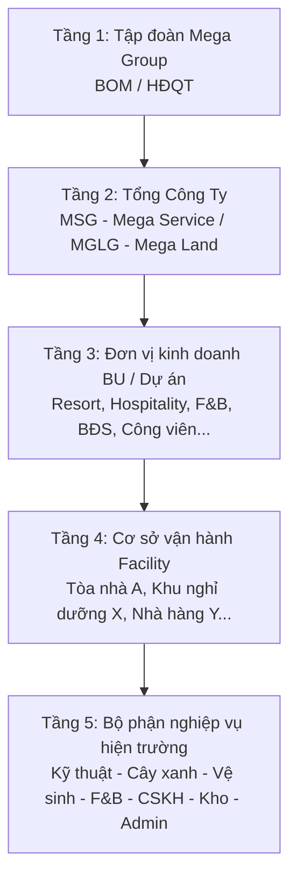
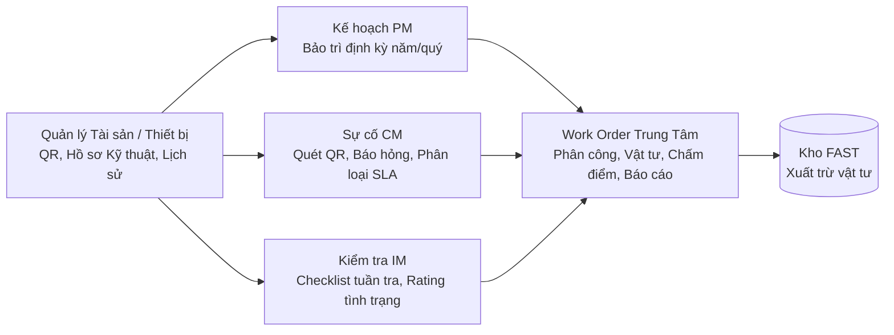
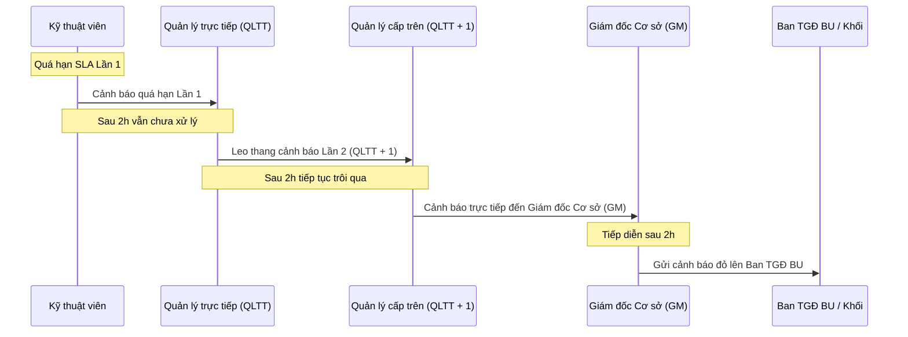
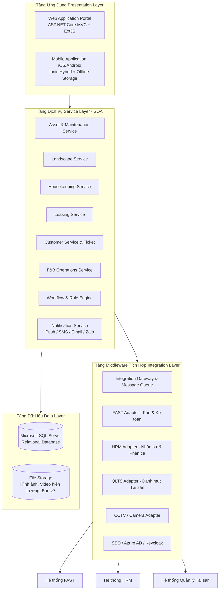
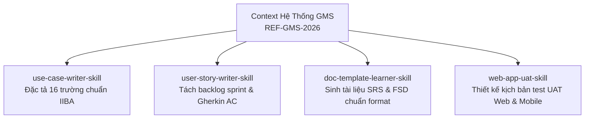

# BÁO CÁO TỔNG HỢP & NẠP CONTEXT HỆ THỐNG GMS (GENERAL MANAGEMENT SYSTEM)
> **Tài liệu tham chiếu gốc:** `docs/templates/URD_GMS_Specification_Reference.pdf` (và bản nguồn `docs/inputs/URD_GMS_Specification_Reference.docx`)  
> **Mã số định danh URD:** `REF-GMS-2026`  
> **Ngày phê duyệt chính thức:** 30/03/2026  
> **Chủ đầu tư / Khách hàng:** TẬP ĐOÀN BẤT ĐỘNG SẢN & DỊCH VỤ ĐA NGÀNH (MegaCorp - MSG, MGLG)  
> **Đơn vị phát triển / Triển khai:** CÔNG TY PHÁT TRIỂN GIẢI PHÁP PHẦN MỀM DOANH NGHIỆP (TechPartner)  
> **Biên soạn & Tổng hợp Context:** AI Business Analyst Agent · BA Zone Toolkit  

---

## 📌 MỤC LỤC TỔNG QUAN
1. [Giới Thiệu Chung & Mục Tiêu Dự Án](#1-giới-thiệu-chung--mục-tiêu-dự-án)
2. [Cấu Trúc Tổ Chức & Ma Trận Phân Quyền (5 Tầng)](#2-cấu-trúc-tổ-chức--ma-trận-phân-quyền-5-tầng)
3. [Phân Tích 6 Phân Hệ Nghiệp Vụ Cốt Lõi (Core Modules)](#3-phân-tích-6-phân-hệ-nghiệp-vụ-cốt-lõi-core-modules)
   - [3.1. Phân hệ Quản lý Kỹ thuật - Bảo trì - Sửa chữa (MTS & Asset)](#31-phân-hệ-quản-lý-kỹ-thuật---bảo-trì---sửa-chữa-mts--asset)
   - [3.2. Phân hệ Quản lý Cảnh quan & Cây xanh (Landscape)](#32-phân-hệ-quản-lý-cảnh-quan--cây-xanh-landscape)
   - [3.3. Phân hệ Quản lý Vệ sinh & Housekeeping (HK)](#33-phân-hệ-quản-lý-vệ-sinh--housekeeping-hk)
   - [3.4. Phân hệ Quản lý Bất động sản Cho thuê / Đi thuê (Leasing)](#34-phân-hệ-quản-lý-bất-động-sản-cho-thuê--đi-thuê-leasing)
   - [3.5. Phân hệ Dịch vụ Khách hàng & Đồ thất lạc (CSKH & Lost & Found)](#35-phân-hệ-dịch-vụ-khách-hàng--đồ-thất-lạc-cskh--lost--found)
   - [3.6. Phân hệ Quản lý Ẩm thực Nhà hàng (F&B Operations)](#36-phân-hệ-quản-lý-ẩm-thực-nhà-hàng-fb-operations)
4. [Cơ Chế Điều Hành, Chuẩn Hóa Checklist & Cảnh Báo Leo Thang SLA](#4-cơ-chế-điều-hành-chuẩn-hóa-checklist--cảnh-báo-leo-thang-sla)
5. [Kiến Trúc Kỹ Thuật, Công Nghệ & Tích Hợp Hệ Sinh Thái](#5-kiến-trúc-kỹ-thuật-công-nghệ--tích-hợp-hệ-sinh-thái)
6. [Hạ Tầng, Bảo Mật, Quy Hoạch Dung Lượng (Sizing)](#6-hạ-tầng-bảo-mật-quy-hoạch-dung-lượng-sizing)
7. [Giả Định, Ràng Buộc, Phạm Vi Ngoài (Out of Scope) & Ghi Chú BOM](#7-giả-định-ràng-buộc-phạm-vi-ngoài-out-of-scope--ghi-chú-bom)
8. [Mapping Context Vào Bộ Kỹ Năng BA Zone (Next Steps)](#8-mapping-context-vào-bộ-kỹ-năng-ba-zone-next-steps)

---

## 1. Giới Thiệu Chung & Mục Tiêu Dự Án

### 1.1. Bối cảnh ra đời
Mega Group sở hữu hệ sinh thái vận hành đa ngành rộng lớn (Mega Service, Mega Land, khu đô thị, resort, khách sạn, công viên giải trí, chuỗi nhà hàng ẩm thực, tòa nhà văn phòng...). Tuy nhiên, hiện trạng vận hành trước khi có GMS gặp nhiều tồn tại lớn:
- **Dữ liệu phân mảnh**: Dữ liệu lưu trữ rời rạc bằng Excel, sổ sách giấy, nhóm chat Zalo, email.
- **Quy trình thiếu chuẩn hóa**: Mỗi BU (Business Unit), mỗi cơ sở áp dụng SOP/Checklist riêng biệt, phụ thuộc nhiều vào kinh nghiệm cá nhân của trưởng bộ phận.
- **Khó kiểm soát SLA & Hiệu suất**: Cấp lãnh đạo tập đoàn và tổng công ty không có góc nhìn thời gian thực (real-time) về tỷ lệ sự cố, tiến độ xử lý, chi phí vận hành và vi phạm cam kết chất lượng dịch vụ (SLA).
- **Vòng đời tài sản không liên thông**: Thiếu thông tin đồng bộ về hồ sơ kỹ thuật, lịch sử bảo trì, kiểm định định kỳ và chi phí linh kiện thay thế.

### 1.2. Định nghĩa hệ thống GMS
**GMS (General Management System)** là nền tảng phần mềm quản lý vận hành tổng thể tập trung, đa tầng, đa phân hệ, phục vụ toàn diện các mảng dịch vụ - kỹ thuật - vận hành cho các đơn vị kinh doanh thuộc Mega Services.

### 1.3. Nguyên tắc kiến trúc cốt lõi
1. **Lấy vận hành thực tế làm cơ sở, quản lý làm trung tâm**: Giao diện Mobile tối giản hóa thao tác cho công nhân hiện trường (kỹ thuật, tạp vụ, làm vườn), trong khi Web Portal cung cấp Dashboard phân tích chuyên sâu cho cấp quản lý.
2. **Quản lý tập trung – Vận hành phân quyền**: Dữ liệu và chuẩn mực quy trình được thiết lập tập trung ở cấp Tập đoàn/Tổng công ty, nhưng việc thực thi và phân quyền dữ liệu được phân chia rành mạch theo từng BU và Cơ sở.
3. **Không thay thế hệ thống lõi hiện có (Non-disruptive Integration)**: GMS đóng vai trò nền tảng điều phối vận hành, tích hợp 2 chiều và khai thác dữ liệu từ các hệ thống chuyên dụng hiện hữu:
   - **FAST**: Quản lý xuất nhập tồn kho, vật tư, giá trị hạch toán.
   - **HRM**: Cơ cấu tổ chức, hồ sơ nhân sự, lịch phân ca.
   - **QLTS**: Hồ sơ danh mục tài sản doanh nghiệp.
   - **ERP / Tài chính**: Trung tâm chi phí (cost center), thanh toán, kế toán tổng hợp.
   - **CCTV / IoT / POS / PMS**: Dữ liệu giám sát hình ảnh, đặt phòng, đơn hàng ăn uống.

---

## 2. Cấu Trúc Tổ Chức & Ma Trận Phân Quyền (5 Tầng)

Hệ thống GMS áp dụng mô hình tổ chức phân cấp hình cây (**Organization Structure Tree**) 5 tầng nghiêm ngặt:

### 2.1. Ma trận vai trò người dùng (User Personas & Responsibilities)

| Nhóm người dùng | Nền tảng chính | Quyền hạn & Trách nhiệm chính trong GMS |
|---|---|---|
| **Ban Giám Đốc / HĐQT Tập đoàn (BOM)** | Web Portal | Theo dõi Dashboard tổng thể toàn hệ thống; so sánh hiệu suất giữa các BU; giám sát vi phạm SLA nghiêm trọng; phê duyệt chủ trương lớn. |
| **Lãnh đạo Tổng công ty (MSG / MGLG)** | Web Portal | Quản trị vận hành nhóm BU trực thuộc; kiểm soát chi phí vận hành, ngân sách bảo trì, tỷ lệ hài lòng khách hàng toàn tổng công ty. |
| **Quản lý BU (BU Manager / Director)** | Web Portal | Giám sát KPI, kế hoạch bảo trì năm, tình hình tuyển dụng/phân ca, tỷ lệ lấp đầy mặt bằng thuộc BU phụ trách. |
| **Giám đốc cơ sở (GM / Facility Manager)** | Web Portal & Mobile | Điều hành trực tiếp cơ sở; duyệt kế hoạch làm việc tuần/tháng; duyệt checklist, nghiệm thu Work Order quan trọng; xử lý sự cố khẩn cấp. |
| **Trưởng bộ phận nghiệp vụ (Kỹ thuật, HK, Cảnh quan, F&B, CSKH)** | Web Portal & Mobile | Lập kế hoạch vận hành, phân công nhiệm vụ, ban hành checklist chi tiết, chấm điểm đánh giá nhân viên, theo dõi tiêu hao vật tư. |
| **Nhân viên hiện trường (Kỹ thuật viên, Tạp vụ, Làm vườn, Bếp)** | **Mobile App (Ưu tiên)** | Nhận lệnh công việc (Work Order), quét mã QR tài sản/vị trí, làm checklist có chụp ảnh trước/sau + GPS, báo cáo sự cố on-site, làm việc Offline khi mất mạng. |
| **Nhân viên CSKH (Helpdesk / Guest Relations)** | Web Portal & Mobile | Tiếp nhận khiếu nại qua đa kênh (Hotline, Zalo OA, QR code khách quét); điều phối ticket; kích hoạt cơ chế Pause SLA; gửi survey hài lòng; quản lý Lost & Found. |
| **Thủ kho (Warehouse Keeper)** | Web Portal & Mobile | Nhận yêu cầu vật tư từ Work Order; kiểm tra tồn kho (đồng bộ FAST); tạo phiếu xuất/nhập/hủy; kiểm kê kho qua QR; theo dõi min-max. |
| **Quản trị hệ thống (System Admin)** | Web Portal | Cấu hình cây tổ chức, phân quyền RBAC, Data-Scope theo OU, quản lý danh mục dùng chung/đặc thù, cấu hình Dynamic Workflow và Escalation Rules. |

---

## 3. Phân Tích 6 Phân Hệ Nghiệp Vụ Cốt Lõi (Core Modules)

### 3.1. Phân hệ Quản lý Kỹ thuật - Bảo trì - Sửa chữa (MTS & Asset)
Trọng tâm là chu trình khép kín: **PM (Preventive) – CM (Corrective) – IM (Inspection)**.

#### Các tính năng chính:
- **Hồ sơ lý lịch thiết bị**: Quản lý mã định danh, số serial, model, hãng sản xuất, bản vẽ, catalogue, CO/CQ, thời hạn bảo hành, hồ sơ pháp lý kiểm định an toàn (PCCC, thang máy, nồi hơi, trạm điện) và cảnh báo tự động đến hạn kiểm định.
- **Mã QR Code tài sản**: Sinh và in tem QR code gắn trực tiếp tại máy móc. Kỹ thuật viên bắt buộc phải quét QR trước khi thực hiện bảo trì và sau khi nghiệm thu hoàn thành.
- **Bảo trì phòng ngừa (PM - Preventive Maintenance)**: Lập kế hoạch bảo trì năm (trước 31/12); hệ thống tự động sinh Work Order theo chu kỳ cấu hình; gửi thông báo nhắc việc trước 3/5/7/15 ngày.
- **Xử lý sự cố sửa chữa (CM - Corrective Maintenance)**: Ghi nhận sự cố đa kênh (Mobile, Web, QR Code). Tự động phân loại 4 cấp độ ưu tiên với SLA chuẩn hóa.
- **Kiểm tra đánh giá tình trạng (IM - Inspection Management)**: Tuần tra theo checklist, ghi nhận thông số (nhiệt độ, áp suất, độ rung), đánh giá tình trạng (Normal, Warning, Critical). Nếu phát hiện lỗi, hệ thống tự động sinh ticket con xử lý sửa chữa theo mô hình Cha-Con (Parent-Child Task).
- **Liên kết kho FAST**: Tích hợp API đọc số dư tồn kho thời gian thực; lập phiếu đề xuất vật tư gắn liền mã Work Order; thủ kho xác nhận xuất hàng tự động trừ kho FAST.

---

### 3.2. Phân hệ Quản lý Cảnh quan & Cây xanh (Landscape)
Được thiết kế chuyên biệt cho các đại đô thị và khu nghỉ dưỡng sinh thái quy mô lớn của MegaGroup.

- **Quản lý đối tượng đa dạng**: Cây xanh cá thể (cổ thụ, cây quý hiếm có mã QR riêng), lô/bụi cây, thảm cỏ, cây nội thất (sảnh, văn phòng), vườn trên cấu trúc (mái công trình), cảnh quan cứng (Hardscape - ghế đá, đèn chiếu, chòi nghỉ, đường dạo), tiện ích nước (đài phun, hồ cảnh quan), cây vườn ươm.
- **Đánh giá rủi ro cây theo chuẩn quốc tế VTA (Visual Tree Assessment)**: Theo dõi độ nghiêng, mục rỗng thân, sâu mọt, nấm rễ, nguy cơ gãy đổ mùa mưa bão; đề xuất biện pháp chằng chống, cắt tỉa hoặc thanh lý.
- **Bản đồ số GIS & Phân vùng chăm sóc (Zone Management)**:
  * Số hóa bản đồ nền (ảnh vệ tinh, sơ đồ mặt bằng, CAD/GIS).
  * Phân vùng cấp độ chăm sóc: **Zone 1 (Vip/Sảnh chính)**, **Zone 2 (Khu trung tâm)**, **Zone 3 (Vành đai)**, **Zone 4 (Hậu cần/Dự trữ)**.
  * Tần suất tưới, bón phân, cắt tỉa và tiêu chuẩn nghiệm thu gắn liền với thuộc tính phân vùng.
- **Quản lý Hóa chất & Thời gian cách ly**: Theo dõi nhật ký sử dụng thuốc bảo vệ thực vật, phân bón hóa học; cảnh báo khu vực đang cách ly an toàn cho cư dân và du khách.

---

### 3.3. Phân hệ Quản lý Vệ sinh & Housekeeping (HK)
Tối ưu hóa công tác làm sạch phòng khách sạn, căn hộ dịch vụ và khu vực công cộng (Public Area).

- **Quản lý vị trí & Tần suất dọn dẹp**: Thiết lập danh mục buồng phòng, toilet, hành lang, khu gym, spa, nhà hàng; cấu hình tần suất dọn theo ca (đầu/giữa/cuối ca), theo giờ hoặc biến thiên linh hoạt theo tỷ lệ lấp đầy phòng (**Occupancy-based Housekeeping**).
- **Hệ thống Checklist đa cấp độ**:
  * *Hourly*: Kiểm tra vệ sinh nhà vệ sinh công cộng, bổ sung giấy, xà phòng.
  * *Daily*: Dọn dẹp phòng khách hàng ngày, thu gom rác hành lang.
  * *Deep-Clean*: Tổng vệ sinh định kỳ (giặt thảm, lau kính trên cao, đánh bóng sàn đá).
- **Giám sát chất lượng & Đánh giá 1-5 sao**: Giám sát viên kiểm tra hiện trường, chấm điểm trên app, chụp ảnh đối chiếu trước/sau. Nếu "Không đạt", tự động chuyển trạng thái "Yêu cầu làm lại" kèm thông báo cho nhân viên.
- **Theo dõi tiêu hao hóa chất & CCDC**: Ghi nhận lượng nước lau sàn, hóa chất tẩy rửa, khăn lau tiêu hao trực tiếp theo từng đầu việc để kiểm soát định mức chi phí.

---

### 3.4. Phân hệ Quản lý Bất động sản Cho thuê / Đi thuê (Leasing)
Quản lý toàn bộ vòng đời khai thác thương mại mặt bằng (Shophouse, Mall, Outlet, Kiosks, Văn phòng).

- **Danh mục mặt bằng & Tỷ lệ lấp đầy**: Quản lý chi tiết từng Unit/Block/Floor, diện tích thông thủy, diện tích tim tường, công năng sử dụng, hồ sơ pháp lý (Sổ đỏ, Giấy phép PCCC, Bản vẽ hoàn công).
- **Dashboard Doanh thu & KPIs**: Trực quan hóa tỷ lệ lấp đầy (Occupancy %), doanh thu lũy kế, dự báo doanh thu các tháng tiếp theo, so sánh cùng kỳ.
- **Bảng giá thuê linh hoạt**: Hỗ trợ giá thuê cố định theo tháng, giá theo $m^2$, đơn giá theo bậc thang thời gian, chiết khấu ưu đãi, phí dịch vụ tiện ích (điện, nước, an ninh).
- **Vòng đời hợp đồng thuê**:
  * *Tiếp nhận nhu cầu & Đàm phán*: Quản lý version hợp đồng dự thảo, phụ lục (PLHĐ).
  * *Ký kết & Bàn giao*: Checklist bàn giao hiện trạng tài sản, ký biên bản bàn giao điện tử.
  * *Quản lý công nợ & Thu tiền*: Tự động tính toán tiền thuê hàng kỳ, xuất hóa đơn VAT, tích hợp đối soát thanh toán ngân hàng, cảnh báo nợ đọng.
  * *Cảnh báo tự động*: Cảnh báo hợp đồng sắp hết hạn (trước 90, 60, 30 ngày), cảnh báo bổ sung tiền cọc, cảnh báo vi phạm thanh toán.
  * *Thanh lý & Bàn giao hoàn trả*: Kiểm tra hiện trạng hoàn trả mặt bằng, khấu trừ chi phí hư hỏng vào tiền cọc.

---

### 3.5. Phân hệ Dịch vụ Khách hàng & Đồ thất lạc (CSKH & Lost & Found)
Trung tâm tiếp nhận và giải quyết mọi phản ánh, khiếu nại của khách lưu trú, cư dân và đối tác.

- **Tiếp nhận phản ánh đa kênh (Omni-Channel Ticket)**:
  * Khách quét mã QR dán tại phòng/bàn/khu vực công cộng để gửi phản ánh trực tiếp.
  * Hotline tiếp tân, cổng thông tin web, ứng dụng di động, tích hợp Zalo OA.
- **Quy trình điều phối thông minh**: Tự động nhận diện loại khiếu nại (Kỹ thuật, Tiếng ồn, Vệ sinh, Thái độ phục vụ) để tự động bắn Work Order sang bộ phận chuyên trách.
- **Tính năng đặc thù "Tạm dừng SLA có lý do" (Pause SLA)**:
  * Cho phép nhân viên CSKH tạm dừng đồng hồ đếm ngược SLA khi phát sinh lý do khách quan hợp lệ: Chờ khách phản hồi, Chờ vật tư đặc chủng đặt hàng, Chờ nhà thầu bảo hành bên ngoài.
  * Mọi lần tạm dừng đều bắt buộc nhập lý do và lưu vết audit log để chống gian lận SLA.
- **Đánh giá mức độ hài lòng (CSAT Survey)**: Ngay khi ticket hoàn thành, hệ thống tự động gửi link đánh giá ngắn qua SMS/Zalo/App (1-5 sao + bình luận). Kết quả khảo sát được liên kết trực tiếp vào KPI của nhân sự và cơ sở phục vụ.
- **Module Quản lý đồ thất lạc (Lost & Found)**: Tuân thủ quy trình `SOP-CS-02`. Ghi nhận đồ nhặt được (ảnh chụp, ngày giờ, vị trí, người bàn giao), phân loại giá trị (tài sản quý vs đồ thông thường), nơi lưu kho niêm phong, quy trình xác minh chủ sở hữu, biên bản trao trả hoặc thanh lý sau thời hạn lưu giữ quy định.

---

### 3.6. Phân hệ Quản lý Ẩm thực Nhà hàng (F&B Operations)
Số hóa quy trình vận hành chuỗi bếp và nhà hàng theo tiêu chuẩn an toàn cao cấp.

- **Bảng phân công nhân sự (Staff Deployment)**: Số hóa biểu mẫu `SOP-FNB-WI10.F01` phân công công việc FOH (Front of House - phục vụ, thu ngân, bar) và BOH (Back of House - bếp chính, phụ bếp, tạp vụ).
- **Checklist An toàn Vệ sinh Thực phẩm (HACCP)**: Cấu hình checklist đo nhiệt độ kho mát, tủ đông định kỳ nhiều lần trong ngày; checklist vệ sinh bẫy mỡ, hút khói, kiểm tra hạn sử dụng nguyên vật liệu (FIFO).
- **Tiêu chuẩn nhập hàng (Visual Receiving Standard)**: Khi nhân viên nhận rau củ, thịt cá từ nhà cung cấp, hệ thống hiển thị thư viện ảnh chuẩn (màu sắc, độ tươi, quy cách cắt thái) để đối chiếu trực tiếp trên mobile trước khi ký nhận.
- **Định hướng tích hợp KDS (Kitchen Display System) & POS**:
  * GMS quản lý danh mục món ăn và hình ảnh chuẩn để KDS hiển thị kiểm tra đĩa thức ăn trước khi ra món cho khách.
  * Tích hợp dữ liệu hóa đơn POS để phân tích doanh thu bán hàng theo nhân viên phục vụ, làm căn cứ xếp hạng nhân viên xuất sắc.

---

## 4. Cơ Chế Điều Hành, Chuẩn Hóa Checklist & Cảnh Báo Leo Thang SLA

### 4.1. Phân loại sự cố và hạn định SLA cam kết

| Mức độ sự cố | Định nghĩa nghiệp vụ | SLA Xử lý chuẩn | Cấp độ ưu tiên mặc định |
|---|---|:---:|:---:|
| **Mức 1 – Nhẹ (Low)** | Không ảnh hưởng đến an toàn và hoạt động kinh doanh (đèn hành lang nhấp nháy, xước sơn tường). | **12 giờ** | Thấp |
| **Mức 2 – Trung bình (Medium)** | Ảnh hưởng 1 phần dịch vụ nhưng có phương án thay thế (hỏng điều hòa phòng trống, rò rỉ vòi nước nhẹ). | **8 giờ** | Bình thường |
| **Mức 3 – Nghiêm trọng (High)** | Gián đoạn dịch vụ diện rộng hoặc ảnh hưởng trực tiếp đến khách hàng (mất điện tầng, hỏng thang máy, ngập sàn). | **4 giờ** | Cao |
| **Mức 4 – Khẩn cấp (Critical)** | Nguy cơ mất an toàn tính mạng, tài sản lớn hoặc tê liệt vận hành (Chập cháy, rò rỉ gas, vỡ đường ống nước chính, sự cố PCCC). | **2 giờ** | Khẩn cấp |

> [!IMPORTANT]
> **Quy tắc ưu tiên tài sản trọng yếu:** Các tài sản cốt lõi như Hệ thống PCCC, Trạm biến áp, Chiller trung tâm, Máy phát điện dự phòng, Hệ thống máy bơm chính khi phát sinh sự cố sẽ **mặc định nhảy vào nhóm ưu tiên xử lý cao nhất**, bất kể người nhập ban đầu chọn mức độ nào.

### 4.2. Cơ chế Leo Thang Cảnh Báo Quá Hạn (Escalation Rule Engine)
Để chấm dứt tình trạng ticket bị "bỏ quên", GMS thiết lập cơ chế thông báo leo thang đa tầng tự động:

- **Thống kê vi phạm**: Hệ thống tự động ghi nhận số lần vi phạm SLA của từng nhân sự và bộ phận, xuất lên Dashboard tổng hợp gửi Ban Giám đốc vào ngày cuối tháng để phục vụ đánh giá KPI và xét thưởng/phạt.

---

## 5. Kiến Trúc Kỹ Thuật, Công Nghệ & Tích Hợp Hệ Sinh Thái

### 5.1. Mô hình kiến trúc đa tầng (Multi-tier Architecture)

### 5.2. Công nghệ lựa chọn (Tech Stack)
- **Backend**: C# trên nền tảng **.NET Core 8**, kiến trúc Layered Architecture phân tách rành mạch (Separation of Concerns), tuân thủ Clean Code & Stateless RESTful API.
- **Cơ sở dữ liệu**: **Microsoft SQL Server (2014 trở lên)**, hỗ trợ Data Partitioning, Index chuyên sâu theo khối lượng lớn dữ liệu vận hành.
- **Web Application**: **ASP.NET Core MVC** kết hợp **ExtJS**, tối ưu cho các màn hình nghiệp vụ phức tạp, điều hướng bảng biểu lớn và cấu hình workflow động.
- **Mobile Application**: **Ionic Framework** chạy đa nền tảng (iOS & Android).
  * **Tính năng Offline Mode**: Tự động lưu cache dữ liệu cục bộ (Local Storage/SQLite) cho danh mục tồn kho, checklist dọn dẹp, ticket kỹ thuật. Khi nhân viên di chuyển vào vùng mất sóng (tầng hầm, rừng cây, thang máy), app vẫn cho phép tích checklist, chụp ảnh và cập nhật bình thường -> Tự động đồng bộ (Auto-sync) lên server ngay khi có kết nối trở lại.
  * Tích hợp phần cứng: Camera chụp ảnh/quay video trước-sau, định vị GPS gắn tọa độ và timestamp xác thực thời gian thực, máy quét QR code.

### 5.3. Chiến lược tích hợp (Integration Principles)
- **Decoupling**: Tuyệt đối không gọi trực tiếp từ giao diện đến API của hệ thống ngoài; toàn bộ giao dịch phải đi qua `Integration Service` trung gian để tránh treo hệ thống khi đối tác ngoài bị nghẽn mạng.
- **Mô hình Pull & Push linh hoạt**:
  * *Pull (Định kỳ qua Cronjob)*: Kéo danh mục vật tư, đơn giá nhập kho từ FAST; kéo sơ đồ tổ chức, danh sách nhân viên từ HRM.
  * *Push (Real-time qua Webhook)*: Khi Work Order hoàn thành cần xuất kho, GMS đẩy dữ liệu phiếu xuất sang FAST; khi khách tạo ticket phản ánh khẩn cấp, đẩy thông báo sang hệ thống chăm sóc khách hàng.
- **Cơ chế Retry & Idempotency**: Khi gọi API hệ thống ngoài gặp lỗi timeout, hệ thống tự động thử lại 3 lần (3s -> 10s -> 30s). Nếu vẫn thất bại, lưu transaction vào `Integration Queue` và thử lại định kỳ mỗi 5 phút, đảm bảo tính bất biến (không bị nhân đôi phiếu xuất).

---

## 6. Hạ Tầng, Bảo Mật, Quy Hoạch Dung Lượng (Sizing)

### 6.1. Quy hoạch cấu hình máy chủ vật lý (Deployment Topology)
Mô hình tiêu chuẩn tách biệt 02 Server độc lập chạy trên mạng nội bộ tốc độ cao:

| Tiêu chí cấu hình | Web Application Server | Database Server |
|---|---|---|
| **CPU** | 16 Cores 2.0 GHz | 16 Cores 2.0 GHz |
| **RAM** | 16 GB | 16 GB |
| **Ổ cứng lưu trữ** | 500 GB SSD (Hỗ trợ RAID an toàn) | 100 GB SSD (Dành riêng OS & CSDL) |
| **Card mạng** | 1 Gbps Ethernet | 1 Gbps Ethernet |
| **Hệ điều hành & Nền tảng** | Windows Server, IIS, .NET Core 8 | Windows Server, MS SQL Server 2014+ |
| **Bảo mật mạng** | Mở Port 443 (HTTPS), Port 80 (chỉ để redirect sang 443) | Chỉ mở kết nối nội bộ từ Web Server sang DB Server |

### 6.2. Kế hoạch sao lưu (Backup Policy)
- **Full Database Backup**: Thực hiện tự động lúc **00:00 hàng ngày**, lưu trữ xoay vòng từ 14 đến 30 ngày.
- **Incremental Backup**: Thực hiện định kỳ **6 giờ/lần** để hạn chế tối đa nguy cơ mất mát dữ liệu (RPO < 6h).
- **File Storage Backup**: Sao lưu toàn bộ kho media (ảnh chụp, video minh chứng, tài liệu đính kèm) hàng ngày sang vùng lưu trữ dự phòng riêng biệt.

### 6.3. Ước tính dung lượng tăng trưởng (Capacity Sizing)
- **Dữ liệu có cấu trúc (Database Data Sizing)**: Bao gồm Work Orders, Tickets, Checklist logs, Audit trails, Master data -> Ước tính tăng trưởng trung bình: **~60 GB/năm**.
- **Dữ liệu tệp đính kèm (Media Storage Sizing)**: Ảnh chụp hiện trường trước-sau, video ngắn panorama 180 độ, tài liệu hợp đồng, biên bản scan -> Ước tính tăng trưởng trung bình: **~1 TB/năm**.

---

## 7. Giả Định, Ràng Buộc, Phạm Vi Ngoài (Out of Scope) & Ghi Chú BOM

### 7.1. Nội dung nằm ngoài phạm vi (Out of Scope)
- Không can thiệp hoặc thay thế logic nghiệp vụ kế toán, tài chính chuyên sâu của phần mềm kế toán lõi.
- Không xây dựng các phân hệ quản lý sản xuất công nghiệp hoặc bán hàng CRM chuyên sâu ngoài mảng vận hành bất động sản cho thuê.
- Không chỉnh sửa cấu trúc dữ liệu nội tại của các hệ thống nguồn (FAST, HRM, PMS).

### 7.2. Các ý kiến chỉ đạo trọng điểm từ Lãnh đạo Vận hành (BOM Representative)
1. **Chuyển SOP thành Checklist Audit**: Hệ thống phải cho phép tải lên quy trình SOP chuẩn của các bộ phận, tự động chuyển hóa thành Checklist vận hành và Checklist Audit có chấm điểm, gắn KPI và thời gian hoàn thành.
2. **Theo dõi chi phí vận hành chi tiết**: Trong Work Order và Quản lý kỹ thuật, bắt buộc phải bổ sung đơn giá nhập của vật tư/phụ tùng để tính toán chính xác chi phí bảo trì và chi phí vận hành cho từng khu vực, từng outlet cụ thể.
3. **Kết nối hồ sơ khách hàng (Guest Profile)**: CSKH cần liên kết với hệ thống PMS để nắm bắt lịch sử lưu trú, các than phiền trong quá khứ nhằm nâng cao chất lượng phục vụ.
4. **Mobile App thân thiện & Chống điểm mù**: Giao diện cho nhân sự lao động phổ thông phải cực kỳ tối giản, chữ to, hỗ trợ chụp ảnh trước-sau và quay video ngắn 180 độ ở các góc máy chật hẹp.
5. **Ưu tiên tài sản rủi ro cao**: Các hệ thống Chiller, PCCC, máy phát điện phải luôn có mức độ ưu tiên xử lý cao nhất trong hàng đợi bảo trì.

---

## 8. Mapping Context Vào Bộ Kỹ Năng BA Zone (Next Steps)

Với toàn bộ context hệ thống GMS đã được nạp đầy đủ, các AI Skills trong workspace `ba-zone` có thể được kích hoạt ngay lập tức để phục vụ giai đoạn phát triển tiếp theo:

1. **`use-case-writer-skill`**:
   - Khởi tạo các Use Case chuẩn 16 trường (Karl Wiegers):
     * `UC-MTS-01: Lập kế hoạch bảo trì phòng ngừa (Annual PM Plan)`.
     * `UC-MTS-02: Tiếp nhận và phân loại sự cố kỹ thuật đột xuất (CM Ticket)`.
     * `UC-LAND-01: Đánh giá rủi ro cây xanh theo phương pháp VTA`.
     * `UC-CSKH-01: Xử lý khiếu nại khách hàng & Kích hoạt cơ chế Pause SLA`.
2. **`user-story-writer-skill`**:
   - Phân rã User Stories theo cấu trúc chuẩn INVEST kèm bộ 3 kịch bản Gherkin (Happy Path, Edge Case, Negative Path) cho Mobile App (offline sync, scan QR, chụp ảnh trước-sau).
3. **`doc-template-learner-skill`**:
   - Sử dụng để đọc template SRS của tổ chức và tự động sinh bản đặc tả kỹ thuật chi tiết (SRS) cho từng phân hệ dựa trên URD này.
4. **`web-app-uat-skill`**:
   - Xây dựng Test Matrix và kịch bản nghiệm thu UAT 8 bước cho ứng dụng Mobile Ionic và Web Portal ExtJS khi hệ thống bước vào giai đoạn bàn giao.

---
*(Báo cáo được hoàn thiện và lưu trữ tại [docs/URD_GMS_SYSTEM_CONTEXT_REPORT.md](file:///d:/repo/ba-zone/docs/URD_GMS_SYSTEM_CONTEXT_REPORT.md))*.
