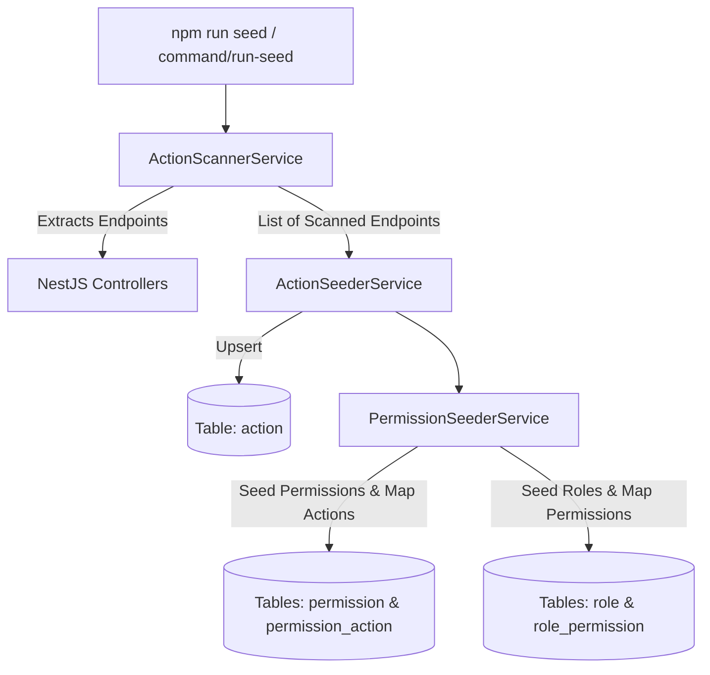

# Architecture Spine (DRAFT)

## 1. Design Paradigm

**Modular Layered & Clean Architecture** — Hệ thống được thiết kế theo mô hình kiến trúc phân tầng dạng module độc lập
(Modular Monolith / Microservices-ready). Tất cả các module chia ranh giới, phân tách tuyệt đối giữa Presentation,
Business Logic (Domain/Application) và Infrastructure.

Tất cả mọi request từ bên ngoài đều đi qua `application-gateway` để thực hiện xác thực (JWT Verification), cache kiểm
tra phiên người dùng và header enrichment trước khi chuyển tiếp (dispatch) đến Upstream Service (Backend) xử lý chức năng.

Các backend service không thực hiện login/logout/identification, nhận request header
`x-user-id, x-user-email, x-request-id` được chuyển từ `application-gateway` và kiểm tra quyền (authorization).

```
┌─────────────────────────────────────────────────────────────────────────────┐
│                             FRONTEND UI                                     │
│  React 19 + Ant Design 6 + TanStack Query v5 (Feature-First Architecture)   │
└──────────────────────────────────────┬──────────────────────────────────────┘
                                       │ HTTP REST (JSON / Multipart)
                                       ▼
┌─────────────────────────────────────────────────────────────────────────────┐
│                          APPLICATION GATEWAY                                │
│  JWT Verification ──► Redis Authentication Cache ──► Header Enrichment      │
│                      (x-user-id, x-user-email, x-request-id)                │
└───────────────────────┬─────────────────────────────────────────────────────┘
                        │ HTTP REST Reverse Proxy / ConnectRPC Dispatch
                        ▼
┌─────────────────────────────────────────────────────────────────────────────┐
│                     UPSTREAM SERVICE (Clean Architecture)                   │
│                                                                             │
│  ┌───────────────────────────────────────────────────────────────────────┐  │
│  │ 1. Controller / Presentation Layer (Thin)                             │  │
│  │    • REST Controllers (Singular: {prefix}/v1/internal/{res}/{act})    │  │
│  │    • ConnectRPC Handlers / WebSocket Gateways                         │  │
│  │    • Zod DTO Validation / Pipe / MongoQueryParser Pipeline            │  │
│  └───────────────────────────────────┬───────────────────────────────────┘  │
│                                      │ (DTOs / Commands)                    │
│  ┌───────────────────────────────────▼───────────────────────────────────┐  │
│  │ 2. Application & Domain Service Layer (Pure Business Logic)           │  │
│  │    • Use Cases / Application Services / Business Invariants           │  │
│  │    • State Mutation Invariants (Immutability), Excel Processors       │  │
│  │    • Port Definitions (IRepositories, IAdapters, IEventBus)           │  │
│  └───────────────────────────────────┬───────────────────────────────────┘  │
│                                      │ (Calls via Interfaces / Ports)       │
│  ┌───────────────────────────────────▼───────────────────────────────────┐  │
│  │ 3. Infrastructure & Persistence Layer (Adapters / Output)             │  │
│  │    • TypeORM Repositories (MSSQL / Postgres / Mongo, zero-sync)       │  │
│  │    • Redis Client (Cache & Session)                                   │  │
│  │    • External Adapters (ISapAdapter, Mailer, Third-party APIs)        │  │
│  └───────────────────────────────────────────────────────────────────────┘  │
└─────────────────────────────────────────────────────────────────────────────┘
```

## 2. Rules

### Standard Technology Stack Requirements

- **Binds:** `all backend, frontend, and mobile applications/services across the system`
- **Prevents:** Phân mảnh công nghệ (tech stack drift), thiếu đồng bộ kiến trúc, gia tăng chi phí bảo trì và cản trở
  luân chuyển nhân sự giữa các dự án.
- **Rule:** Tuân thủ danh mục công nghệ chuẩn hóa sau:
    - **Backend:**
        - **Ngôn ngữ lập trình:** `TypeScript`
        - **Framework:** `NestJS`
        - **ORM / Persistence:** `TypeORM`
        - **Validation:** `Zod`
        - **Cơ sở dữ liệu (Database):** `MSSQL` (ưu tiên), `PostgreSQL`, `MongoDB`
    - **Frontend:**
        - **Ngôn ngữ lập trình:** `TypeScript`
        - **Core UI & Framework:** `ReactJS`, `Next.js` (dành cho các ứng dụng có yêu cầu SSR - Server-Side Rendering)
        - **Validation:** `Zod`
        - **Client State Management:** `Zustand`
        - **Server State & Data Fetching:** `React Query` (`TanStack Query`)
    - **Mobile:**
        - **Ngôn ngữ lập trình:** `TypeScript`
        - **Framework:** `React Native`

### Protocol Service Interface

- **Binds:** `all controllers and RPC handlers in backend`
- **Prevents:** Phân mảnh giao thức, bỏ sót endpoint trong phân quyền RBAC
- **Rule:** Backend cung cấp 2 giao thức:
    1. **HTTP REST API**: Bắt buộc, phục vụ `application-gateway` reverse proxy.
    2. **ConnectRPC**: Optional, phục vụ giao tiếp high-performance giữa các microservice nội bộ.

### Zero-Synchronize TypeORM & Strict Reversible Migration Invariant

- **Binds:** `TypeORM configuration, database migrations in all environments`
- **Prevents:** Mất dữ liệu vô ý do tự động sync schema, không thể rollback khi release gặp lỗi
- **Rule:** Thuộc tính `synchronize` của TypeORM bắt buộc **LUÔN LUÔN BẰNG FALSE (`synchronize: false`)** trong tất cả
  các môi trường (Dev, Test, Staging, Production). 100% thay đổi cấu trúc bảng, khóa ngoại và chỉ mục phải được thực
  hiện qua các file Migration độc lập có đầy đủ 2 phương thức `up(queryRunner)` và `down(queryRunner)`.

### Quality, Size Ceilings & Minimum 99.5% Test Coverage Invariants

- **Binds:** `all code, tests, and pull requests across backend and frontend`
- **Prevents:** Hàm phình to, mã nguồn khó bảo trì, thiếu sót kiểm thử
- **Rule:**
    1. Tuân thủ nguyên lý **SOLID** và **DRY**.
    2. **Max 100 LOC / function hoặc method**.
    3. **Max 300 LOC / file**.
    4. **Cyclomatic Complexity $\le 10$ / function**.
    5. **Tối thiểu $\ge 99.5\%$ Test Coverage** cho cả **Lines** và **Branches** trên toàn bộ unit test và integration
       test.

### Database Schema Isolation: Table Prefix.

- **Binds:** `all database tables, columns, indexes, and queries`
- **Prevents:** Xung đột bảng nếu dùng chung CSDL với các ứng dụng khác.
- **Rule:** Tất cả các bảng bắt buộc có tiền tố **`{prefix}_`** (e.g. `gms_project`, `gms_product`, `gms_facility`).

### Feature-First Frontend Architecture

- **Binds:** `all components, hooks, and pages in reactjs project`
- **Prevents:** Sprawling UI codebase, khó khăn khi mở rộng các phân hệ mới
- **Rule:** Frontend tổ chức theo từng tính năng độc lập dưới thư mục `src/features/{prefix}-*` (e.g.
  `property-project`, `property-category`, `property-product`). Mỗi feature tự đóng gói components, hooks (TanStack
  Query v5), services, types.

### Singular REST API Routing & RBAC Permission Mapping

- **Binds:** `all REST endpoints and Gateway route mappings`
- **Prevents:** Bất đồng bộ trong quy ước đặt tên endpoint.
- **Rule:**
    - Global Path Prefix: Dùng service prefix `{service-prefix}` cho tất cả endpoints (e.g.
      `user-service/v1/internal/user/detail/:id`, `user-service/v1/internal/organization/list`).
    - Controller Base Path: Chứa version, scope (internal: nội bội, external: khách hàng/đối tác bên ngoài, public: công
      khai, không cần permission). Dùng danh từ số ít `v1/internal/{resource}` (e.g. `v1/internal/project`,
      `v1/internal/product`).
    - Action Endpoints: Dùng định dạng `{action_name}/:id` với danh từ số ít (e.g. `create`, `list`, `detail/:id`,
      `update/:id`, `delete/:id`, `import-excel`, `export-excel`). Tuyệt đối không dùng danh từ số nhiều trong URL.

---

## 3. Consistency Conventions

| Lĩnh vực                        | Quy chuẩn bắt buộc                                                                                                                                                                                                                                           |
|---------------------------------|--------------------------------------------------------------------------------------------------------------------------------------------------------------------------------------------------------------------------------------------------------------|
| **Tech Stack (Backend)**        | TypeScript, NestJS, TypeORM, Zod, MSSQL (ưu tiên), PostgreSQL, MongoDB.                                                                                                                                                                                      |
| **Tech Stack (Frontend)**       | TypeScript, ReactJS, Next.js (for SSR), Zod, Zustand, React Query, Ant Design, MUI, Tailwind.                                                                                                                                                                |
| **Tech Stack (Mobile)**         | TypeScript, React Native.                                                                                                                                                                                                                                    |
| **Naming (Entities & Tables)**  | PascalCase cho Entity (ví dụ: `GmsProjectEntity`), snake_case với prefix `gms_` cho Table (ví dụ: `gms_project`).                                                                                                                                            |
| **Naming (Files & Modules)**    | kebab-case cho tất cả files (ví dụ: `project.controller.ts`, `product.service.ts`, `use-property-projects.ts`).                                                                                                                                              |
| **Naming (Interfaces & Types)** | PascalCase, tiền tố `I` cho interfaces trừu tượng (`ISapAdapter`, `IMongoQueryOptions`).                                                                                                                                                                     |
| **Date Format (Timestamp)**     | ISO-8601 UTC `DATETIME2` (`YYYY-MM-DDTHH:mm:ss.sssZ`) cho dates.                                                                                                                                                                                             |
| **API Response Envelope**       | Single: `{ ok: true, statusCode: 200, statusMessage:"SUCCESS", data: T }`<br/>List: `{ ok: true, statusCode: 200, statusMessage:"SUCCESS", data: T[], total: number }`<br/>Error: `{ ok: false, statusCode: string, statusMessage: string, data?: unknown }` |
| **State Mutation**              | Immutability hoàn toàn: Không mutate object/mảng gốc; sử dụng object spread (`{ ...item, status }`) hoặc mapper functions.                                                                                                                                   |
| **Audit Columns**               | `createdAt`, `updatedAt`, `deletedAt` (soft-delete), `createdBy`, `updatedBy`.                                                                                                                                                                               |

---

## 4. RBAC Architecture: Actions, Permissions & Roles

### 4.1 Overview

- Mỗi User hoặc JobCode (chức danh) được gán vào nhiều Role. Mỗi Role gán nhiều Permission. Mỗi Permission gán nhiều
  Action (API Endpoint).
- Trên UI Component giới hạn theo Permission. Phía API Middleware giới hạn theo Action (API Endpoint).

### 4.2 Seeder Service & Action Scanner Design

Quy trình tự động hóa nạp quyền (RBAC Automation Pipeline) trong NestJS Backend:

1. **Controller Action Scanner**: Quét tất cả Controller classes và các method handler để trích xuất URI endpoint đầy
   đủ: `/{service_prefix}/v1/internal/{resource}/{action}`.
2. **Action Seeding**: Upsert các endpoint tìm thấy vào bảng `action`.
3. **Permission & Role Seeding**: Khởi tạo danh mục Permission và gán Action tương ứng vào bảng `permission_action`;
   đồng thời khởi tạo các Role chuẩn và gán Permission tương ứng vào bảng `role_permission`.



### 4.3 Mẫu dữ liệu Roles & Permission & Action Endpoints

OM

```typescript
export const GMS_OM_SERVICE_PREFIX = "gms-om";

export const DEFAULT_PROPERTY_PERMISSIONS: PermissionSeedDefinition[] = [
    // 1. Quản lý Dự án, Phân khu, Tháp, Tầng
    {
        code: "gms_om.project.read",
        name: "Xem Dự án & Cấu trúc Phân cấp",
        servicePrefix: GMS_OM_SERVICE_PREFIX,
        actionEndpoints: [
            "/gms-om/v1/internal/project/list",
            "/gms-om/v1/internal/project/detail/:id",
            "/gms-om/v1/internal/zone/list",
            "/gms-om/v1/internal/zone/detail/:id",
            "/gms-om/v1/internal/block/list",
            "/gms-om/v1/internal/block/detail/:id",
            "/gms-om/v1/internal/floor/list",
            "/gms-om/v1/internal/floor/detail/:id",
        ],
    },
    {
        code: "gms_om.project.write",
        name: "Quản lý Dự án & Cấu trúc Phân cấp",
        servicePrefix: GMS_OM_SERVICE_PREFIX,
        actionEndpoints: [
            "/gms-om/v1/internal/project/create",
            "/gms-om/v1/internal/project/update/:id",
            "/gms-om/v1/internal/project/delete/:id",
            "/gms-om/v1/internal/zone/create",
            "/gms-om/v1/internal/zone/update/:id",
            "/gms-om/v1/internal/zone/delete/:id",
            "/gms-om/v1/internal/block/create",
            "/gms-om/v1/internal/block/update/:id",
            "/gms-om/v1/internal/block/delete/:id",
            "/gms-om/v1/internal/floor/create",
            "/gms-om/v1/internal/floor/update/:id",
            "/gms-om/v1/internal/floor/delete/:id",
        ],
    },

    // 2. Quản lý Sản phẩm BĐS (Căn hộ, Nhà ở, Shophouse, Biệt thự) & Import/Export
    {
        code: "gms_om.product.read",
        name: "Xem Chi tiết Sản phẩm BĐS",
        servicePrefix: GMS_OM_SERVICE_PREFIX,
        actionEndpoints: [
            "/gms-om/v1/internal/product/list",
            "/gms-om/v1/internal/product/detail/:id",
        ],
    },
    {
        code: "gms_om.product.write",
        name: "Quản lý Sản phẩm BĐS & Import/Export",
        servicePrefix: GMS_OM_SERVICE_PREFIX,
        actionEndpoints: [
            "/gms-om/v1/internal/product/create",
            "/gms-om/v1/internal/product/update/:id",
            "/gms-om/v1/internal/product/delete/:id",
            "/gms-om/v1/internal/product/import-excel",
            "/gms-om/v1/internal/product/export-excel",
            "/gms-om/v1/internal/product/validate-import",
        ],
    }
];

export const DEFAULT_PROPERTY_ROLES: RoleSeedDefinition[] = [
    {
        code: "gms_om.system_admin",
        name: "System Administrator GMS OM",
        description: "Quản trị toàn quyền hệ thống GMS OM",
        isFullServicePermission: true,
        permissionCodes: ["gms_om.all"],
    },
    {
        code: "gms_om.oam",
        name: "OAM - Vận hành Khai thác GMS OM", om
        description: "Tiếp nhận vận hành, quản lý tiện ích & tài sản kỹ thuật",
        permissionCodes: [
            "gms_om.facility.read",
            "gms_om.facility.write",
            "gms_om.project.read",
            "gms_om.product.read",
        ],
    }
];
```