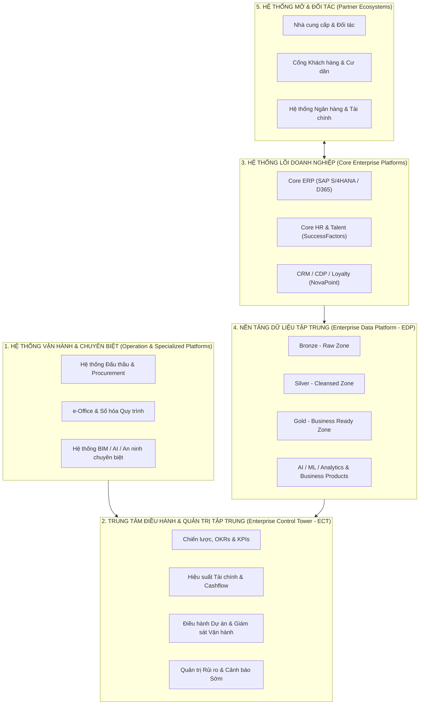
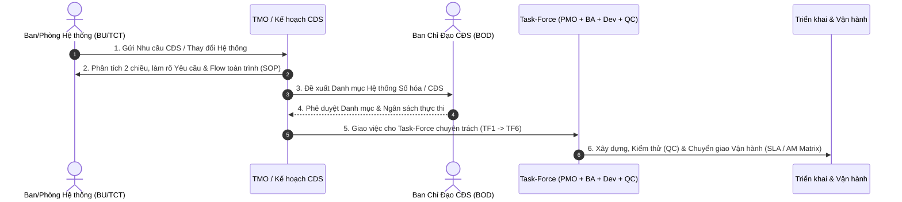

# DIGITAL TRANSFORMATION & ARCHITECTURE ROADMAP BASELINE (2025 - 2030)
> **Trạng thái:** Active Baseline Document  
> **Áp dụng cho:** Tất cả các dự án Chuyển đổi số, Xây dựng Hệ thống, Đặc tả BRD/URD/SRS & UAT tại Tập đoàn  
> **Quy chuẩn Bảo mật:** Enterprise NDA Sanitized (`enterprise-nda-sanitizer` compliant)  

---

## 1. TỔNG QUAN ĐỊNH HƯỚNG CHUYỂN ĐỔI SỐ 2025 - 2030

### 1.1 Tầm nhìn Chiến lược (North Star)
Chuyển đổi toàn diện từ **Doanh nghiệp vận hành truyền thống** thành **Tập đoàn Doanh nghiệp Thông minh (AI-Native Enterprise)** vận hành dựa trên Dữ liệu thời gian thực (Data-Driven), Trí tuệ nhân tạo (AI-Powered), Lấy khách hàng/nhân viên làm trung tâm (Customer/Employee-Centric) và Nền tảng Công nghệ Tài chính (Fintech-Enabled).

### 1.2 5 Nguyên tắc Kiến trúc Cốt lõi (Architectural Principles)
1. **API-First & Microservices**: Mở và linh hoạt, dễ dàng mở rộng và tích hợp các ứng dụng vệ tinh.
2. **Data-Driven & Cloud-Native**: Dữ liệu là tài sản trung tâm, hạ tầng điện toán đám mây linh hoạt, chống chịu cao.
3. **AI-First & Automation**: Tích hợp Trí tuệ nhân tạo và Tự động hóa vào mọi quy trình nghiệp vụ (Hyper-Automation).
4. **Secure by Design & Zero Trust**: Bảo mật đa lớp, phân quyền chặt chẽ theo thẩm quyền.
5. **Data as a Product & Trusted Governance**: Dữ liệu được quản trị chất lượng minh bạch, có bản quyền sử dụng rõ ràng.

---

## 2. PHÂN HOẠCH KHÔNG GIAN KIẾN TRÚC HỆ THỐNG (ENTERPRISE ARCHITECTURE)

Kiến trúc Công nghệ Tập đoàn được phân chia thành **5 Tầng Kiến trúc Cốt lõi**:

---

## 3. LỘ TRÌNH 5 WAVE CHUYỂN ĐỔI SỐ (ROADMAP 2024 - 2030+)

| Wave | Giai đoạn | Mục tiêu Trọng tâm | Nền tảng Công nghệ Chủ lực |
|---|---|---|---|
| **Wave 1** | **2024 - 2025** | **Nền tảng & Chuẩn hóa (Foundation)** | Chuẩn hóa quy trình SOP, Triển khai ERP, SuccessFactors, e-Office, Thiết lập Data Governance & MDM. |
| **Wave 2** | **2025 - 2027** | **Tích hợp & Hợp nhất (Integration)** | Triển khai EDP Phase 1, Tích hợp CRM/CDP, NovaPoint Loyalty, Báo cáo Quản trị Trung tâm, ESB Integration. |
| **Wave 3** | **2027 - 2028** | **Thông minh & Kết nối (Predictive)** | Dự báo Nhu cầu/Dòng tiền, AI Copilots cho Nhân viên, ECT Phase 2 (Real-time Decision), IoT / Smart Property. |
| **Wave 4** | **2028 - 2029** | **Tự động & Tối ưu (Autonomous Operations)** | Hyper-Automation (RPA + AI Agents), Simulation & Digital Twin cho Dự án, Tự động hóa Testing & Release. |
| **Wave 5** | **2030+** | **Doanh nghiệp AI-Native (AI-Native Enterprise)** | Vận hành dựa trên AI tự chủ (Autonomous Execution), Hệ sinh thái mở kết nối toàn diện, Tăng trưởng bền vững ESG. |

---

## 4. MÔ HÌNH VẬN HÀNH IT & QUY TRÌNH PHỐI HỢP TASK-FORCE

### 4.1 Mô hình IT-as-a-Business
Trung tâm Công nghệ (TTCN) vận hành theo cơ chế đơn vị cung cấp dịch vụ chuyên nghiệp trong nội bộ Tập đoàn:
- **Front Office**: 
  - **Văn phòng Quản lý Chuyển đổi số (TMO)**: Quản lý danh mục đầu tư, tư vấn chiến lược, Tech Business Partners.
  - **Văn phòng Điều phối Triển khai (DO)**: Quản lý dự án (PMO), Quản lý thay đổi & Đột phá sử dụng (Change Management & Adoption).
- **Back Office**:
  - **Khối Triển khai Kỹ thuật**: Thiết kế, Xây dựng, Chuyển giao và Vận hành Sản phẩm / Dịch vụ CNTT.
  - **Trung tâm Dịch vụ Chia sẻ (GSS - Shared Services)**: Vận hành hạ tầng, An toàn thông tin, Hỗ trợ người dùng 24/7.
  - **Trung tâm Thực hành Xuất sắc (CoE)**: Chuẩn hóa kiến trúc, Đào tạo, Xây dựng AI/Data Capabilities.

### 4.2 Chu trình Phối hợp Yêu cầu Chuyển đổi số (Task-Force Interaction)

---

## 5. NỀN TẢNG THỰC THI NGHIỆP VỤ TẬP TRUNG: ONE NOVA

### 5.1 Hành trình Nhân viên 12 Bước (Employee Journey)
Mọi giải pháp phần mềm liên quan đến Nhân sự và Quản trị Công việc phải tích hợp chuẩn hóa theo **12 bước**:
1. *Thu hút & Tuyển dụng* (ATS/Career Site)
2. *Offer & Nhận việc* (E-Offer / Contract)
3. *Onboarding* (Welcome Kit / Welcome Portal)
4. *Đào tạo & Phát triển* (LMS / Learning Path)
5. *Làm việc hàng ngày* (Task Management / Collaboration / Knowledge Base)
6. *Đánh giá Hiệu suất & Phản hồi* (KPI / OKR 360)
7. *Ghi nhận & Khen thưởng* (NovaPoint Recognition / Leader Board)
8. *Phát triển Sự nghiệp & Luân chuyển* (Career Path / Succession Plan)
9. *Chăm sóc & Phúc lợi* (Well-being / Insurance / Benefit Portal)
10. *Thay đổi Vai trò / Bộ phận* (Re-onboarding / Role Change)
11. *Chia tay* (Exit Survey / Offboarding Asset Return)
12. *Alumni & Người đại sứ* (Rehire / Referral Network)

### 5.2 Cơ chế Phân rã KPI & Ma trận Thẩm quyền Phê duyệt (Approval Matrix - AM)
- **Cơ chế Cascade KPI**: Phân rã mục tiêu chỉ số từ AOP Tập đoàn $\rightarrow$ TCT/BU $\rightarrow$ Khối/Ban $\rightarrow$ Phòng/Trung tâm $\rightarrow$ Nhóm/Team $\rightarrow$ Cá nhân.
- **Quy tắc Trọng số**: Trọng số KPI tổng cộng tại mỗi cấp **phải đúng bằng 100%**.
- **Ma trận AM (Approval Matrix)**: Mọi quy trình số hóa trên One Nova phải khai báo rõ ràng Ma trận Thẩm quyền Phê duyệt (Approval Matrix - AM) theo đúng cấp bậc, hạn mức phê duyệt và luồng ủy quyền hợp lệ. Tuyệt đối không dùng Authority Matrix.

---

## 6. QUY CHUẨN ÁP DỤNG DÀNH CHO IT BUSINESS ANALYST (BA GUIDELINES)

Khi nhận bất kỳ Dự án hoặc Yêu cầu Số hóa mới nào trong Tập đoàn, BA **bắt buộc**:
1. **Đối chiếu Lộ trình Wave**: Xác định giải pháp thuộc Wave nào trong Roadmap 2025-2030 để thiết lập phạm vi (Scope In/Out) phù hợp.
2. **Kiến trúc Tích hợp**: Mọi ứng dụng mới đều phải thiết kế kết nối EDP (Enterprise Data Platform) qua API Gateway / ESB và tích hợp SSO One Nova.
3. **Đặc tả Phân quyền & Phê duyệt**: Đổi toàn bộ các thuật ngữ cũ (RBAC, Phân quyền đơn thuần) thành **"Ma trận Thẩm quyền Phê duyệt (Approval Matrix - AM)"** hoặc **"Ma trận Phê duyệt (AM)"** trong tất cả tài liệu URD, BRD, SRS và Test Plan. Tuyệt đối không dùng thuật ngữ Authority Matrix.
4. **Bảo mật NDA**: Lưu trữ tài liệu dưới dạng ẩn danh (Generalized) theo đúng chuẩn `enterprise-nda-sanitizer`.

---
*Tài liệu Baseline này được trích xuất và chuẩn hóa tự động từ Slide Chiến lược CĐS NVG 2025-2030.*
