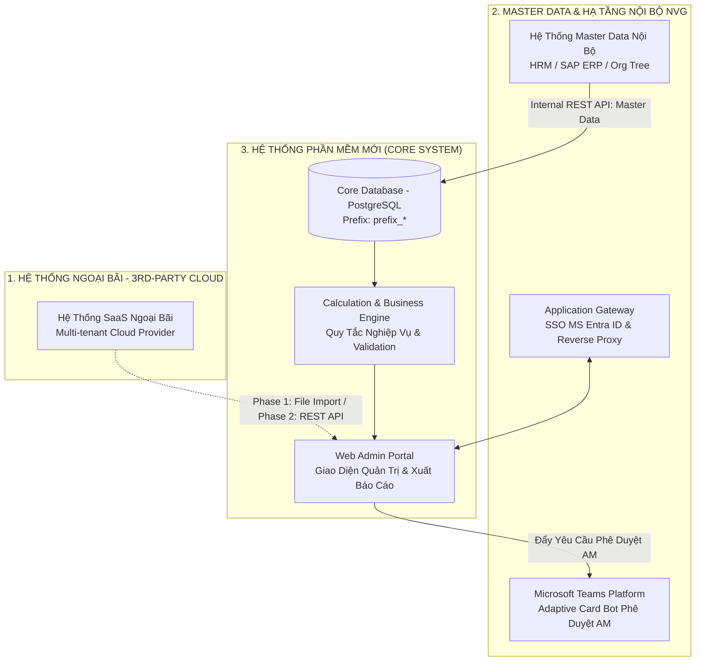
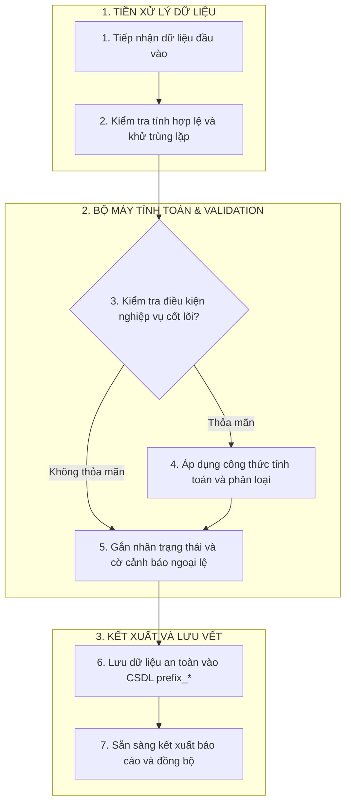
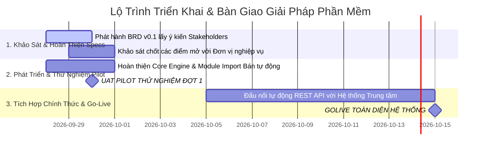

# MẪU ĐẶC TẢ YÊU CẦU NGHIỆP VỤ & THIẾT KẾ GIẢI PHÁP TIÊU CHUẨN (NVG STANDARD BRD / SAD TEMPLATE)
> **Mã số mẫu biểu tập đoàn:** `NVG-ITD-SOP14.F01` (Tài liệu Thiết kế Giải pháp - Solution Architecture & Design / BRD-Solution)  
> **Mã định danh template:** `TEMPLATE-BRD-NVG-STD-2026`  
> **Đơn vị ban hành:** Khối Công nghệ Thông tin & Chuyển đổi số (NVG-ITC)  
> **Áp dụng cho:** IT Business Analysts, Solution Architects, Product Owners khi soạn thảo BRD, SAD, URD, FSD cho toàn bộ ứng dụng phần mềm tại Tập đoàn NovaGroup.  
> **Quy chuẩn kiểm soát bắt buộc:**  
> 1. Chuẩn hóa Ma trận Thẩm quyền thành **`AM - Authority Matrix`** (tuyệt đối không dùng thuật ngữ RBAC đơn thuần; bắt buộc phân tách 2 tầng: Quyền chức năng và Phạm vi dữ liệu `Security L7 Data Scope`).  
> 2. Tuân thủ `enterprise-nda-sanitizer` (bảo vệ thông tin PII, định danh hợp đồng và credential bảo mật).  
> 3. Tuân thủ Tiêu chuẩn Kiến trúc `Dev Architecture Spine Baseline 2026` (Zero Local Auth qua SSO Gateway, tiền tố CSDL `{prefix}_*`, Strict Soft-delete 100%, Async Queue cho tác vụ nặng).  
> 4. Phân định rõ ràng phương thức kết nối: **API vs Direct DB vs Bán tự động (File Import)**.

---

# CÔNG TY CỔ PHẦN NOVAGROUP
## TÀI LIỆU THIẾT KẾ GIẢI PHÁP
### [TÊN DỰ ÁN / PHÂN HỆ HỆ THỐNG PHẦN MỀM]

> **Mã số định danh tài liệu:** `[BRD/SAD]-[MÃ DỰ ÁN]-2026-v[X.X]`  
> **Phiên bản:** `v0.1 - Initial Draft Baseline` (Bản thảo khảo sát đầu tiên) / `v1.0` (Chính thức nghiệm thu)  
> **Ngày lập:** [DD/MM/YYYY]  
> **Tác giả:** [Họ tên Lead IT BA] · Senior IT Business Analyst (`[email]@novagroup.vn`)  
> **Chủ trì & Phê duyệt:**  
> - **Sponsor:** Ms. Hồ Thị Trang (Giám đốc Bộ phận Quản lý CĐS ITC - `itc.gdbp.4@novagroup.vn`)  
> - **PMO Specialist:** Ms. Thái Ngọc Anh Tú (ITC PMO - `itc.cg.3@novagroup.vn`)  
> - **Technical Lead / Architect:** Mr. Nguyễn Đức Hùng (ITC Dev Lead - `itc.hungnd@novagroup.vn`)  
> - **Đại diện Đơn vị Nghiệp vụ:** [Họ tên, chức vụ, email người đặt hàng]  

---

## 📌 MỤC LỤC TỔNG QUAN (NVG-ITD-SOP14.F01 STANDARD)
1. [Bảng Ghi Nhận Thay Đổi Tài Liệu (Document Change History)](#1-bảng-ghi-nhận-thay-đổi-tài-liệu-document-change-history)
2. [Thông Tin Chung (General Information)](#2-thông-tin-chung-general-information)
   - 2.1. [Phạm vi tài liệu](#21-phạm-vi-tài-liệu-document-scope)
   - 2.2. [Mục đích tài liệu](#22-mục-đích-tài-liệu-document-purpose)
   - 2.3. [Khái niệm, thuật ngữ & Từ viết tắt](#23-khái-niệm-thuật-ngữ--từ-viết-tắt-glossary--terminology)
   - 2.4. [Tài liệu tham khảo](#24-tài-liệu-tham-khảo-references)
3. [Tổng Quan Ứng Dụng (Application Overview)](#3-tổng-quan-ứng-dụng-application-overview)
   - 3.1. [Mục đích & Chỉ số SMART](#31-mục-đích--chỉ-số-smart-goals)
   - 3.2. [Phạm vi hệ thống & Ranh giới Pilot / Go-Live](#32-phạm-vi-hệ-thống--ranh-giới-pilot--go-live)
   - 3.3. [Quyền hạn sử dụng & Ma trận AM (Authority Matrix)](#33-quyền-hạn-sử-dụng--ma-trận-am-authority-matrix)
4. [Mô Tả Yêu Cầu Chức Năng (Functional Requirements)](#4-mô-tả-yêu-cầu-chức-năng-functional-requirements)
   - 4.1. [Danh sách yêu cầu chức năng & Phân hệ nghiệp vụ](#41-danh-sách-yêu-cầu-chức-năng--phân-hệ-nghiệp-vụ-feature-matrix)
   - 4.2. [Đặc tả Use Cases chi tiết (Core Use Cases)](#42-đặc-tả-use-cases-chi-tiết-core-use-cases)
5. [Giải Pháp Hệ Thống (System Architecture & Solution Design)](#5-giải-pháp-hệ-thống-system-architecture--solution-design)
   - 5.1. [Kiến trúc tổng thể & Phân định kết nối (API vs Direct DB)](#51-kiến-trúc-tổng-thể--phân-định-kết-nối-api-vs-direct-db)
   - 5.2. [Giải pháp Cơ sở Dữ liệu & Bảng ánh xạ Schema](#52-giải-pháp-cơ-sở-dữ-liệu--bảng-ánh-xạ-schema-prefix_)
   - 5.3. [Công thức tính toán & Ma trận Kịch bản Kiểm thử](#53-công-thức-tính-toán--ma-trận-kịch-bản-kiểm-thử-flexible-policy)
   - 5.4. [Cấu trúc dữ liệu xuất báo cáo & Tích hợp Lakehouse](#54-cấu-trúc-dữ-liệu-xuất-báo-cáo--tích-hợp-lakehouse)
   - 5.5. [Giả định thiết kế, Điểm cần khảo sát & Kế hoạch triển khai](#55-giả-định-thiết-kế-điểm-cần-khảo-sát--kế-hoạch-triển-khai)

---

## 1. BẢNG GHI NHẬN THAY ĐỔI TÀI LIỆU (DOCUMENT CHANGE HISTORY)

| Ngày | Tác giả | Mô tả thay đổi | Phiên bản | Tính năng | Ghi chú (*) |
|:---:|---|---|:---:|---|:---:|
| [DD/MM/YYYY] | [Họ tên tác giả BA] | Khởi tạo baseline từ kết quả khảo sát & đề xuất ban đầu | `V0.0` | `BASE` | `M` |
| [DD/MM/YYYY] | [Họ tên tác giả BA] | Chuẩn hóa theo `NVG-ITD-SOP14.F01`; ban hành bản thảo khảo sát đầu tiên gửi Lãnh đạo & PMO | `V0.1` | `ALL` | `S` |
| [DD/MM/YYYY] | [Họ tên tác giả BA] | Cập nhật theo kết quả UAT Pilot và nghiệm thu chính thức | `V1.0` | `ALL` | `S` |

*\*Ghi chú ký hiệu quy chuẩn NVG:*  
- **M (New):** Thêm mới yêu cầu / tính năng  
- **S (Modify):** Sửa đổi yêu cầu / luồng xử lý  
- **X (Delete):** Xóa bỏ / Hủy tính năng  

---

## 2. THÔNG TIN CHUNG (GENERAL INFORMATION)

### 2.1. Phạm vi tài liệu (Document Scope)
* **Đối tượng tiếp nhận & áp dụng:** Dành cho các bên liên quan gồm Lãnh đạo Khối nghiệp vụ, PMO, IT BA, Kiến trúc sư giải pháp (SA), Đội ngũ Phát triển phần mềm (Dev), và Đội ngũ Kiểm thử chất lượng (QA/QC).
* **Ranh giới phân kỳ triển khai:**
  - **Giai đoạn 1 (Phase 1 / Pilot):** [Mô tả phạm vi thử nghiệm hoặc tính năng MVP bắt buộc hoàn thành sớm].
  - **Giai đoạn 2 (Phase 2 / Mở rộng):** [Mô tả các tính năng nâng cao, tự động hóa sâu, kết nối API chính thức].

### 2.2. Mục đích tài liệu (Document Purpose)
* Chuyển hóa toàn diện các yêu cầu bài toán nghiệp vụ từ Đơn vị yêu cầu thành kiến trúc giải pháp hệ thống chi tiết.
* Xác định phương thức tích hợp kỹ thuật giữa hệ thống mới và hệ sinh thái hiện hữu của Tập đoàn.
* Làm căn cứ kỹ thuật phục vụ khảo sát lấy ý kiến, nghiệm thu chất lượng (UAT Criteria) và ký biên bản hoàn thành giải pháp phần mềm giữa Khối nghiệp vụ và Khối CNTT (ITC).

### 2.3. Khái niệm, thuật ngữ & Từ viết tắt (Glossary & Terminology)

| Thuật Ngữ / Viết Tắt | Tên Tiếng Anh Đầy Đủ | Giải Thích Định Nghĩa Nghiệp Vụ Tại NovaGroup |
|---|---|---|
| **AM** | **Authority Matrix** | **Ma trận Phân quyền & Thẩm quyền Phê duyệt** tại NovaGroup (thay thế thuật ngữ RBAC đơn thuần, phân tách Functional Permission và Security L7 Data Scope). |
| **EDP** | Enterprise Data Platform | Nền tảng dữ liệu tập trung (Lakehouse) của Tập đoàn NovaGroup. |
| **SSO** | Single Sign-On | Đăng nhập một lần cho toàn bộ người dùng nội bộ thông qua Application Gateway + Microsoft Entra ID. |
| **Server Clock** | Authoritative Server Clock | Đồng hồ máy chủ chuẩn (múi giờ GMT+7, chính xác đến giây), là căn cứ pháp lý duy nhất để ghi nhận log. |
| **[THUẬT NGỮ 1]** | [Full Name 1] | [Định nghĩa nghiệp vụ chuyên ngành của dự án]. |
| **[THUẬT NGỮ 2]** | [Full Name 2] | [Định nghĩa nghiệp vụ chuyên ngành của dự án]. |

### 2.4. Tài liệu tham khảo (References)

| STT | Tên Tài Liệu / Mã Tham Chiếu | Phiên Bản / Ngày Ban Hành | Nguồn / Đơn Vị Ban Hành |
|:---:|---|:---:|---|
| 1 | `NVG-ITD-SOP14.F01`: Mẫu Thiết kế Tài liệu Giải pháp | 2026 | Khối CNTT & CĐS (NVG-ITC) |
| 2 | `NVG-ITD-SOP01.F01`: Phiếu Yêu cầu Phát triển Ứng dụng | 2025 | Khối CNTT & CĐS (NVG-ITC) |
| 3 | [Tài liệu bài toán nghiệp vụ từ Đơn vị yêu cầu] | [YYYY] | [Đơn vị nghiệp vụ] |
| 4 | [Biên bản cuộc họp làm việc / Discovery Workshop] | [DD/MM/YYYY] | ITC & Stakeholders |
| 5 | Baseline Kiến trúc Kỹ thuật (`Dev Architecture Spine 2026`) | 2026 | Khối CNTT (NVG-ITC) |

---

## 3. TỔNG QUAN ỨNG DỤNG (APPLICATION OVERVIEW)

### 3.1. Mục đích & Chỉ số SMART (Objectives & SMART Goals)
* **Hiện trạng As-Is:** [Mô tả chi tiết cách thức người dùng đang làm thủ công bằng Excel, giấy tờ, công cụ rời rạc; các lãng phí thời gian và sai sót].
* **Nút thắt bài toán (Pain Points):** [Liệt kê 3 - 5 rủi ro và nút thắt cốt lõi thúc đẩy nhu cầu số hóa].
* **Mục tiêu To-Be & Chỉ số SMART:**
  - **S (Specific):** Xây dựng giải pháp phần mềm chuyên dụng giải quyết dứt điểm [nêu rõ bài toán cốt lõi].
  - **M (Measurable):** Đạt tỷ lệ tự động hóa [X]%, thời gian xử lý giảm từ [X ngày] xuống [Y phút], thời gian phản hồi hệ thống $\le 3$ giây.
  - **A (Achievable):** Tận dụng tối đa [X]% hạ tầng và module sẵn có, đảm bảo tính khả thi cao trong triển khai.
  - **R (Relevant):** Bám sát định hướng Chuyển đổi số của Lãnh đạo Tập đoàn.
  - **T (Time-bound):** Bàn giao thử nghiệm (Pilot/UAT) vào ngày [DD/MM/YYYY], Go-Live toàn diện vào ngày [DD/MM/YYYY].

### 3.2. Phạm vi hệ thống & Ranh giới Pilot / Go-Live
> **Lưu ý ranh giới then chốt:** Cần phân định rõ ràng giữa mốc Go-Live chính thức của các hệ thống nền tảng dùng chung và mốc UAT Pilot thử nghiệm của dự án để tránh xung đột kỳ vọng của Stakeholder.

* **Phạm vi trong hệ thống (In-Scope Phase 1 / Pilot):** [Liệt kê các module, chức năng MVP bắt buộc hoàn thành trong đợt đầu].
* **Phạm vi ngoài hệ thống (Out-of-Scope Phase 2 / Future):** [Liệt kê các tính năng nâng cấp hoãn lại giai đoạn sau để bảo vệ tiến độ].

### 3.3. Quyền hạn sử dụng & Ma trận AM (Authority Matrix)
Tuân thủ toàn diện chuẩn mực kiến trúc `Dev Architecture Spine Baseline 2026`: Phân tách ranh giới rõ ràng giữa **Quyền chức năng (Functional Permissions)** và **Phạm vi dữ liệu (Security L7 Data Scope)**:

| Mã Quyền | Vai Trò Nghiệp Vụ (AM Role) | Quyền Thao Tác Chức Năng | Thẩm Quyền Phê Duyệt | Phạm Vi Dữ Liệu Cho Phép (Data Scope) |
|:---:|---|---|---|---|
| `AM-01` | **Người dùng đầu cuối (`End-User`)** | [Tạo yêu cầu, xem thông tin cá nhân] | Không | Dữ liệu do chính người dùng tạo ra |
| `AM-02` | **Chuyên viên phụ trách (`Operator`)** | [Xử lý nghiệp vụ, đối soát dữ liệu] | Không | Phân khu / Đơn vị được phân công |
| `AM-03` | **Quản lý phê duyệt (`Approver / Manager`)** | [Thẩm định hồ sơ, yêu cầu bổ sung] | Ký duyệt / Từ chối hồ sơ | Khối / Phòng ban trực thuộc |
| `AM-04` | **Lãnh đạo đơn vị (`Director / BOM`)** | [Xem báo cáo tổng thể, dashboard] | Phê duyệt cấp Tập đoàn | Toàn khối / Toàn đơn vị kinh doanh |
| `AM-05` | **Quản trị Kỹ thuật (`System Admin`)** | [Cấu hình hệ thống, quản trị danh mục] | Toàn quyền cấu hình | Toàn hệ thống (System-wide) |

---

## 4. MÔ TẢ YÊU CẦU CHỨC NĂNG (FUNCTIONAL REQUIREMENTS)

### 4.1. Danh sách yêu cầu chức năng & Phân hệ nghiệp vụ (Feature Matrix)

| Mức Ưu Tiên | Mã Chức Năng | Tên Chức Năng Nghiệp Vụ | Phân Kỳ Triển Khai | Mô Tả Tóm Tắt Giải Pháp Kỹ Thuật |
|:---:|:---:|---|:---:|---|
| **Ưu tiên 1** | `REQ-01` | [Tên chức năng cốt lõi 1] | Phase 1 (Pilot) | [Mô tả chi tiết giải pháp kỹ thuật, cơ chế tiếp nhận dữ liệu] |
| **Ưu tiên 1** | `REQ-02` | [Tên chức năng cốt lõi 2] | Phase 1 (Pilot) | [Mô tả chi tiết giải pháp kỹ thuật, cơ chế xử lý dữ liệu] |
| **Ưu tiên 1** | `REQ-03` | [Tính toán tự động / Validation] | Phase 1 (Pilot) | [Mô tả giải thuật tính toán và kiểm tra điều kiện hợp lệ] |
| **Ưu tiên 1** | `REP-01` | [Xuất báo cáo chi tiết] | Phase 1 (Pilot) | [Xuất biểu mẫu báo cáo chi tiết từng giao dịch theo chuẩn Excel] |
| **Ưu tiên 2** | `REQ-04` | [Tính năng mở rộng / Audit Trail] | Phase 2 | [Màn hình điều chỉnh dữ liệu có lưu vết kiểm toán và lý do giải trình] |
| **Ưu tiên 2** | `REQ-05` | [Kênh phê duyệt di động] | Phase 2 | [Đẩy thông báo phê duyệt qua MS Teams Bot / Mobile App] |
| **Ưu tiên 2** | `API-01` | [Tích hợp tự động 2 chiều API] | Phase 2 | [Đấu nối API với hệ thống trung tâm thay thế thao tác import file] |

### 4.2. Đặc tả Use Cases chi tiết (Core Use Cases - Karl Wiegers Standard)

#### [UC-01] — [Tên Use Case Cốt Lõi 1]
* **Tác nhân (Actor):** [Tên vai trò thực hiện, vd: Học viên / Khách hàng / Nhân viên].
* **Điều kiện tiên quyết (Preconditions):** [Điều kiện trước khi kích hoạt Use Case].
* **Luồng xử lý chính (Main Flow):**
  1. Người dùng kích hoạt thao tác tại [màn hình/thiết bị].
  2. Hệ thống kiểm tra điều kiện hợp lệ [nêu các validation rules].
  3. Hệ thống ghi nhận dữ liệu vào CSDL và sinh mã tham chiếu.
  4. Hệ thống phản hồi kết quả thành công cho người dùng trong vòng [X] giây.
* **Luồng ngoại lệ (Alternative / Exception Flows):**
  - *Ngoại lệ 1:* [Điều kiện lỗi 1] ➔ [Cách thức hệ thống phản hồi và hướng xử lý].
  - *Ngoại lệ 2:* [Điều kiện lỗi 2] ➔ [Cách thức hệ thống phản hồi và hướng xử lý].
* **Dữ liệu ghi nhận (Data Entities):** [Tên bảng CSDL lưu vết, vd: `prefix_transactions`].
* **Điều kiện kết thúc (Postconditions):** [Trạng thái của hệ thống sau khi hoàn tất Use Case].

---

## 5. GIẢI PHÁP HỆ THỐNG (SYSTEM ARCHITECTURE & SOLUTION DESIGN)

### 5.1. Kiến trúc Tổng thể & Phân Định Kết Nối (API vs Direct DB)
> **Nguyên tắc phân định kiến trúc bắt buộc:**
> 1. **Hệ thống SaaS Cloud của bên thứ 3 (SAP, Salesforce...):** Tuyệt đối **KHÔNG ĐƯỢC CHỌC VÀO DB**, bắt buộc kết nối qua **REST API / Webhook**. Trong giai đoạn Pilot có thể dùng phương án bán tự động **File Import (Excel/CSV)** để kiểm soát tiến độ.
> 2. **Hệ thống Master Data nội bộ (HRM, SSO...):** Kết nối qua **Internal REST API** qua Application Gateway.
> 3. **Hạ tầng Người dùng nội bộ:** 100% tuân thủ **Zero Local Auth** (SSO qua Microsoft Entra ID).

### 5.2. Giải pháp Cơ sở Dữ liệu & Bảng Ánh Xạ Schema (`{prefix}_*`)
Tuân thủ toàn diện các quy chuẩn kiến trúc `Dev Architecture Spine Baseline 2026`:
- Toàn bộ các bảng CSDL phải mang tiền tố chuẩn hóa **`{prefix}_*`** theo tên viết tắt của dự án.
- 100% các bảng đều tích hợp đầy đủ 5 cột audit metadata: `created_at`, `updated_at`, `deleted_at`, `created_by`, `updated_by`.
- **Strict Soft-Delete Invariant 100%:** Tuyệt đối không xóa vật lý (Zero Hard-Delete), chỉ cập nhật timestamp tại cột `deleted_at`.
- **Async Queue:** Xử lý bất đồng bộ (RabbitMQ/NATS) cho các tác vụ khối lượng lớn (tính toán hàng loạt, nhập file Excel lớn, xuất PDF).

#### Bảng Ánh Xạ Dữ Liệu Chi Tiết (Data Schema Mapping):

| Trường Dữ Liệu Đích (Target Schema) | Kiểu Dữ Liệu | Bắt Buộc | Trường Dữ Liệu Nguồn | Nguồn Dữ Liệu | Mục Đích Sử Dụng & Quy Tắc Ánh Xạ |
|---|:---:|:---:|---|---|---|
| `entity_id` | `VARCHAR(50)` | **Có** | `sourceId` | Hệ thống nguồn | Khóa chính định danh thực thể |
| `name` | `VARCHAR(255)` | **Có** | `sourceName` | Master Data | Tên hiển thị trên giao diện và báo cáo |
| `status` | `VARCHAR(50)` | **Có** | Mặc định khởi tạo | Business Rules | Trạng thái vòng đời của bản ghi |
| `data_scope_id` | `VARCHAR(50)` | **Có** | Org Unit / Project ID | HRM Master Data | Căn cứ phân quyền dữ liệu Security L7 |

### 5.3. Công thức Tính toán & Ma Trận Kịch Bản Kiểm Thử (Flexible Policy)
> **Nguyên tắc Ma trận Kịch bản Kiểm thử:**  
> Tuyệt đối KHÔNG gán cứng số lượng Test Cases cố định (như 13 cases). Số lượng và độ phủ của Ma trận Kịch bản Kiểm thử phải được xác định linh hoạt căn cứ theo quy mô, bản chất nghiệp vụ và rủi ro thực tế của từng dự án.

#### Sơ đồ Thuật toán Xử lý Nghiệp vụ:

#### Ma Trận Kịch Bản Kiểm Thử Mẫu (Test Scenarios Matrix):
| Case ID | Mô Tả Kịch Bản / Dữ Liệu Đầu Vào | Điều Kiện Nghiệp Vụ Cần Thỏa Mãn | Kết Quả Mong Đợi (Expected Outcome) | Đánh Giá Nghiệm Thu |
|:---:|---|---|---|:---:|
| `TC-01` | [Trường hợp chuẩn mực - Happy Path] | [Đầy đủ điều kiện, đúng mốc thời gian] | Hệ thống ghi nhận thành công 100% | **PASS** |
| `TC-02` | [Trường hợp ranh giới - Edge Case] | [Tại đúng mốc biên thời gian / ngưỡng tối thiểu] | Hệ thống xử lý chính xác theo quy tắc cắt biên | **PASS** |
| `TC-03` | [Trường hợp bất thường / Ngoại lệ] | [Thiếu dữ liệu đầu vào / Dữ liệu bất thường] | Gắn cờ cảnh báo, lưu vết ngoại lệ minh bạch | **PASS** |
| `TC-04` | [Trường hợp dữ liệu ngoài danh mục] | [Thực thể chưa đăng ký trước] | Tự động phân loại vào nhóm riêng để đối soát | **PASS** |

### 5.4. Cấu Trúc Dữ Liệu Xuất Báo Cáo & Tích Hợp Lakehouse

#### 5.4.1. Mẫu Báo Cáo Chi Tiết Giao Dịch Thô (Raw Transaction Logs Export)
* Cung cấp nhật ký kiểm toán toàn diện từng sự kiện: `ID giao dịch`, `Thời gian thực tế Server`, `Người thực hiện`, `Thiết bị`, `Cờ ngoại lệ`.

#### 5.4.2. Mẫu Báo Cáo Tổng Hợp Nghiệp Vụ (Aggregated Rollup Report)
* Cung cấp bảng tổng kết (1 dòng / đối tượng): `Mã đối tượng`, `Họ tên`, `Phòng ban`, `Tổng số lượng / Thời lượng thực tế`, `Tỷ lệ hoàn thành %`, `Xếp loại đánh giá`, `Ghi chú giải trình`.

### 5.5. Giả Định Thiết Kế, Điểm Cần Khảo Sát & Kế Hoạch Triển Khai
> *Giải quyết trực tiếp yêu cầu của Lãnh đạo CĐS (Ms. Trang): Tách bạch các điểm BA chủ động giả định để kỹ thuật triển khai ngay, các điểm cần phối hợp PMO làm rõ, và lộ trình các bước tiếp theo.*

#### 5.5.1. Danh Mục Giả Định Thiết Kế (Design Assumptions):
* **`ASM-01`:** [Giả định về chuẩn phần cứng, giao thức thiết bị để đội dev triển khai SDK ngay].
* **`ASM-02`:** [Giả định về ngưỡng tham số mặc định của thuật toán].
* **`ASM-03`:** [Giả định về phương án cứu cánh nạp dữ liệu đợt Pilot để không bị phụ thuộc vào tiến độ mở API bên thứ 3].

#### 5.5.2. Danh Mục Điểm Cần Khảo Sát Làm Rõ (Open Clarifications):
* **`CLR-01`:** [Điểm mở nghiệp vụ cần Stakeholder xác nhận chính thức] ➔ *Đơn vị phối hợp:* [Tên đơn vị] ➔ *Quy ước tạm thời:* [Quy ước tạm để Dev làm].
* **`CLR-02`:** [Thủ tục làm việc cấp quyền API từ Vendor đối tác] ➔ *Đơn vị phối hợp:* PMO Ms. Tú ➔ *Quy ước tạm thời:* [Dùng giải pháp import file].

#### 5.5.3. Kế Hoạch Triển Khai & Lộ Trình Phối Hợp (Next Steps & Gantt Chart):

