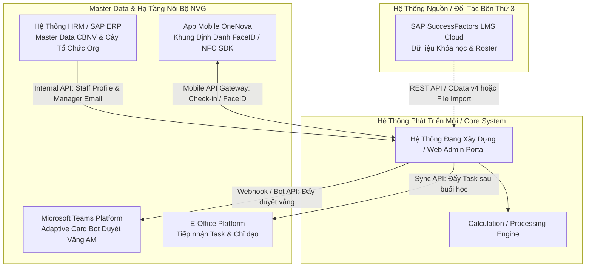
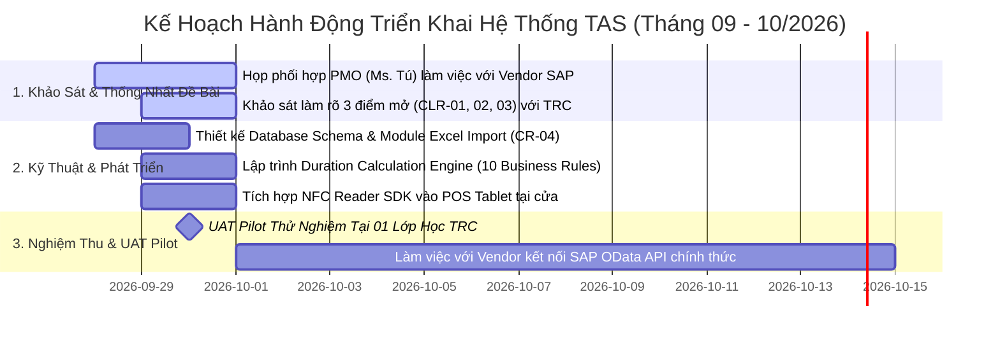

# MẪU ĐẶC TẢ YÊU CẦU NGHIỆP VỤ TIÊU CHUẨN (NVG STANDARD BRD TEMPLATE)
> **Mã số mẫu:** `TEMPLATE-BRD-NVG-STD-2026`  
> **Nguồn gốc chuẩn hóa:** Reverse-engineered từ tài liệu yêu cầu thực tế của Trung tâm Đào tạo NVG (`BRD_UngDungDiemDanh_NFC_v1.pdf`) kết hợp Chuẩn Chỉ đạo CĐS ITC (Ms. Trang - Giám đốc CĐS)  
> **Áp dụng cho:** IT Business Analysts, Product Owners, Technical Writers soạn thảo BRD, URD, FSD trong toàn bộ dự án.  
> **Quy chuẩn kiểm soát:** Tuân thủ `enterprise-nda-sanitizer`, Quy chuẩn Ma trận Thẩm quyền (`AM - Authority Matrix`), và Phân định Kiến trúc Tích hợp (API vs Direct DB vs File Import).  

---

## [TÊN ĐƠN VỊ YÊU CẦU] → [TÊN ĐƠN VỊ THỰC HIỆN / IT-PMO]
# [TÊN ỨNG DỤNG / TÊN HỆ THỐNG]
### Yêu cầu · Tính năng · Tích hợp · Use case · Kế hoạch

| Hạng mục | Thông tin |
|---|---|
| **Gửi** | [Họ tên & Chức danh Người nhận, vd: Ms. Thái Ngọc Anh Tú - ITC-PMO, Ms. Hồ Thị Trang - Giám đốc CĐS] |
| **Từ** | [Họ tên & Chức danh Người đặt yêu cầu, vd: Trợ lý CĐS Đào tạo / Lead IT BA] |
| **Mã yêu cầu** | [Mã tiền tố yêu cầu, vd: REQ-01 đến REQ-05 hoặc NFC-01 đến NFC-05] |
| **Phiên bản** | [Mã phiên bản, vd: V1.0 · DD/MM/YYYY] |

---

## 1. Yêu cầu (Request Overview & Problem Statement)

| Trường thông tin | Nội dung chi tiết |
|---|---|
| **Mã yêu cầu** | [Mã định danh nhóm yêu cầu, vd: REQ-01 đến REQ-05] |
| **Tên yêu cầu** | [Tên tóm tắt một câu về giải pháp mong muốn] |
| **Hạng mục gốc** | [Mục tiêu nghiệp vụ cốt lõi, phạm vi bài toán quản trị] |
| **Người đặt yêu cầu** | [Họ tên và chức danh người đại diện nghiệp vụ] |
| **Bên thực hiện** | [Đơn vị công nghệ / Đội ngũ IT phụ trách] |
| **Ngày gửi** | [DD/MM/YYYY] |
| **Mức ưu tiên** | `High` / `Medium` / `Low` |
| **Hiện đang làm thế nào (As-Is)** | [Mô tả quy trình thủ công hiện tại, công cụ đang dùng, vd: Excel, MS Form, Giấy tờ] |
| **Vấn đề (Pain Points)** | [Các nút thắt, rủi ro, sai sót, lãng phí thời gian của quy trình hiện tại] |
| **Người dùng (Target Personas)** | [Các đối tượng trực tiếp sử dụng hệ thống và đối tượng thụ hưởng báo cáo] |
| **Mong muốn (To-Be Goals)** | [Đầu ra cụ thể mong muốn sau khi ứng dụng phần mềm] |
| **Ràng buộc (Constraints)** | [Các ràng buộc về hệ thống nguồn (SuccessFactors, SAP, HRM), thiết bị phần cứng, nền tảng] |

---

## 2. Danh mục Tính năng & Thứ tự Ưu tiên (Feature Breakdown & Delivery Milestones)

| Ưu tiên | Mã Tính Năng | Yêu Cầu Nghiệp Vụ | Mô Tả Tính Năng / Giải Pháp Chi Tiết | Mốc Hoàn Thành (Deadline) |
|:---:|:---:|---|---|:---:|
| **Ưu tiên 1** | `REQ-01` | [Tên yêu cầu nghiệp vụ 1] | [Mô tả hành vi hệ thống và tính năng cần xây dựng] | [DD/MM/YYYY] |
| **Ưu tiên 1** | `REQ-02` | [Tên yêu cầu nghiệp vụ 2] | [Mô tả hành vi hệ thống và tính năng cần xây dựng] | [DD/MM/YYYY] |
| **Ưu tiên 1** | `REQ-03` | [Tên yêu cầu nghiệp vụ 3] | [Mô tả hành vi hệ thống và tính năng cần xây dựng] | [DD/MM/YYYY] |
| **Ưu tiên 2** | `REQ-04` | [Tên yêu cầu nghiệp vụ 4] | [Tính năng mở rộng, phân loại tự động] | [DD/MM/YYYY] |
| **Ưu tiên 2** | `REQ-05` | [Điều chỉnh dữ liệu / Audit] | [Tính năng sửa đổi dữ liệu có lưu vết Audit Trail] | [Sau DD/MM/YYYY] |
| **Ưu tiên 2** | `REQ-06` | [Cơ chế dự phòng / Fallback] | [Giải pháp dự phòng khi sự cố mạng hoặc quên thiết bị] | [DD/MM/YYYY] |

---

## 3. Kiến trúc Tích hợp & Ánh xạ Dữ liệu (System & Data Integration Mapping)
> *Mục này giải quyết trực tiếp yêu cầu của Lãnh đạo CĐS ITC (Ms. Trang & Architecture Team): Phân định rõ phương thức kết nối (Chọc DB hay API), đối chiếu schema xem có đủ dữ liệu không, và quản trị Master Data (Nhân sự, Org).*

### 3.1. Sơ đồ Tích hợp Hệ sinh thái (Ecosystem Integration Diagram)

### 3.2. Bảng Phân định Phương thức Kết nối (API vs Direct DB vs File Sync)
| Hệ Thống Tích Hợp | Vai Trò & Nguồn Dữ Liệu | Phương Thức Kết Nối (API / Chọc DB / File) | Rào Cản Kỹ Thuật & Giải Pháp | Tần Suất & Chiều Dữ Liệu |
|---|---|:---:|---|:---:|
| **SAP SuccessFactors LMS** | Danh sách lớp học, Mã khóa học, Roster học viên kế hoạch | **API (OData v4)** *(Pilot: Excel File Import)* | • Hệ thống SaaS Cloud của Vendor, **KHÔNG cho phép chọc trực tiếp vào DB**. • Cần PMO làm việc với Vendor cấp OAuth2 API. • *Giải pháp tình thế:* Export Excel ➔ Import Web Admin. | 1 chiều: LMS ➔ Core System (Định kỳ trước buổi học) |
| **HRM / Org Master Data** | Dữ liệu CBNV: Staff ID, Tên, Email, SĐT, Cây tổ chức (Manager Email), UID thẻ chip | **Internal REST API** *(Master Data Service)* | • Dữ liệu nội bộ ITC nắm quyền kiểm soát. • Sử dụng API Gateway nội bộ để lấy dữ liệu CBNV và Người duyệt theo Ma trận AM. | 1 chiều: HRM ➔ Core System (Sync định kỳ 00:00 hàng ngày) |
| **App OneNova Mobile** | Khung xác thực SSO, module điểm danh FaceID, NFC reader POS | **Mobile REST API** | • Đã có sẵn nền tảng App OneNova UAT. • Nhúng thêm SDK / API endpoints phục vụ điểm danh. | 2 chiều: App <--> Core System (Real-time) |
| **MS Teams Bot** | Luồng phê duyệt đơn xin vắng mặt có lý do | **Microsoft Graph API / Teams Webhook** | • Gửi Adaptive Card đến Quản lý trực tiếp (QLTT) theo cây tổ chức HRM. | 2 chiều: Core ➔ Teams ➔ Core (Sự kiện Event-driven) |
| **E-Office Platform** | Đồng bộ nhiệm vụ, bài tập chỉ đạo sau buổi học | **E-Office REST API** | • Đẩy danh sách Task kèm Deadline sang E-Office của từng học viên. | 1 chiều: Core ➔ E-Office (Sau khi kết thúc buổi học) |

### 3.3. Ánh xạ Dữ liệu Chi tiết (Data Schema Mapping)
| Thực Thể Nghiệp Vụ | Trường Nguồn (Source Schema) | Hệ Thống Nguồn | Trường Đích (Target Schema) | Kiểu Dữ Liệu | Bắt Buộc | Ghi Chú & Đánh Giá Đủ Dữ Liệu |
|---|---|---|---|:---:|:---:|---|
| **Mã Học Viên** | `studentID` / `userID` | SAP SF / HRM | `staff_id` | String | Có | Khóa chính đối chiếu duy nhất. |
| **Họ & Tên** | `firstName` + `lastName` | SAP SF / HRM | `full_name` | String | Có | Đồng bộ hiển thị trên bảng điểm danh. |
| **Email Công Ty** | `emailAddress` | SAP SF / HRM | `work_email` | String | Có | Định danh SSO & gửi thông báo nhắc lịch. |
| **Quản Lý Trực Tiếp** | `managerEmail` / `supervisorID` | HRM Master Data | `manager_email` | String | Có | **Bắt buộc** để định tuyến duyệt vắng qua AM. |
| **UID Thẻ Chip** | `nfcCardUID` / `smartCardID` | HRM / Phôi thẻ | `card_uid` | Hex String | Không | Tra cứu nhanh khi học viên quẹt thẻ NFC. |
| **Mã Khóa / Buổi** | `programID` / `classID` | SAP SF LMS | `session_id` | String | Có | Gắn kết quả điểm danh vào đúng khóa học. |
| **Thời Gian Bắt Đầu** | `scheduledStart` | SAP SF / Outlook | `start_time` | Timestamp | Có | Căn cứ cắt khung giờ và tính giờ trễ. |
| **Thời Gian Kết Thúc**| `scheduledEnd` | SAP SF / Outlook | `end_time` | Timestamp | Có | Căn cứ cắt khung giờ và tính về sớm. |

---

## 4. Cách tính toán & Ma trận Kịch bản (Calculation Engine & Test Scenarios)

### 4.1. Quy tắc tính toán (Business Rules)
| Bước | Quy tắc nghiệp vụ (Business Rule) |
|---|---|
| **1. Khử trùng lặp** | Giao dịch quẹt thẻ liên tiếp cách nhau dưới 5 giây của cùng 1 người chỉ được tính là 1 lượt hợp lệ. |
| **2. Ghép cặp / Phân loại** | Giao dịch được ghép cặp tuần tự: Lượt lẻ = VÀO, Lượt chẵn = RA. |
| **3. Cắt theo biên thời gian** | Lượt VÀO trước giờ Bắt đầu kế hoạch được tính từ giờ Bắt đầu. Lượt RA sau giờ Kết thúc được tính đến giờ Kết thúc. Cặp nằm hoàn toàn ngoài khung giờ bị loại bỏ. |
| **4. Công thức tính toán** | Tổng phút học thực tế: $\Delta t = \sum(RA - VÀO)$ của tất cả các cặp hợp lệ trong khung giờ. |
| **5. Xử lý trường hợp lẻ / lỗi** | Nếu có lượt VÀO lẻ cuối buổi không có RA: Gắn cờ `ODD_SWIPE` và cộng thêm thời lượng $\alpha$ theo quy định đơn vị. |
| **6. Xác định mốc Đầu - Cuối** | Giờ Check-in = Lượt VÀO đầu tiên · Giờ Check-out = Lượt RA cuối cùng trong buổi. |
| **7. Quy tắc thời điểm** | Giờ ghi nhận bắt buộc lấy theo đồng hồ chuẩn Máy chủ (Server Clock), không lấy giờ thiết bị client. |
| **8. Quy tắc phân loại kết quả** | Đủ giờ chuyên cần nếu $\Delta t \ge 80\%$ thời lượng buổi học; ngược lại xếp loại Thiếu giờ. |
| **9. Xử lý đối tượng ngoại lệ** | Người quẹt thẻ hợp lệ nhưng không có tên trong Roster được lưu vào danh sách Khách vãng lai riêng, không tính vào sĩ số chính thức. |

### 4.2. Ma trận Kịch bản kiểm thử mẫu (Test Scenarios Matrix)
> Dữ liệu minh họa tính toán theo khung giờ quy định: `08:00` đến `12:00` (Tổng thời lượng: `240 phút`).

| Case | Chuỗi Dữ Liệu Đầu Vào | Dữ Liệu Sau Khi Cắt Biên | Phép Tính Cụ Thể | Kết Quả Đầu Ra | Trạng Thái & Cờ Ghi Nhận |
|:---:|---|---|---|:---:|---|
| **1** | `08:00 · 12:00` | `08:00 → 12:00` | $240$ | **240** | Chuẩn mốc giờ, đạt 100%. |
| **2** | `08:00 · 09:00 · 10:00 · 12:00` | `08:00 → 09:00, 10:00 → 12:00` | $60 + 120$ | **180** | Rời vị trí 1 lần (nghỉ 60 phút). |
| **3** | `07:50 · 09:00 · 10:00 · 12:10` | `08:00 → 09:00, 10:00 → 12:00` | $60 + 120$ | **180** | Cắt biên trước 08:00 và sau 12:00. |
| **4** | `08:00:00 · 08:00:04 · 12:00` | `08:00 → 12:00` | $240$ | **240** | Bỏ lượt trùng 08:00:04 tự động. |
| **5** | `08:00 · 09:00 · 10:00` | `08:00 → 09:00, 10:00 → ?` | $60 + \alpha$ | **$60 + \alpha$** | Gắn cờ: Số lượt lẻ (Không quẹt về). |
| **6** | `08:10 · 12:00` *(Ngoài Roster)*| `08:10 → 12:00` | $230$ | **230** | Lưu riêng danh sách vãng lai. |
| **7** | Có tên trong lớp, không quẹt | *Không có cặp* | $0$ | **0** | Ghi nhận Vắng mặt (Absent). |

---

## 5. Đặc tả Use Cases chi tiết (Core Use Cases)

### 5.1. [UC-01] — Quẹt Thẻ Điểm Danh Vào / Ra Lớp Học
| Trường thông tin | Nội dung đặc tả |
|---|---|
| **Người thực hiện (Actor)** | Học viên / Thiết bị đọc POS / Tablet tại cửa |
| **Điều kiện trước (Precondition)** | Lớp học đã được tạo trên hệ thống; Thiết bị đọc đã đồng bộ danh mục lớp học đang diễn ra. |
| **Luồng chính (Main Flow)** | 1. Học viên chạm thẻ chip NFC vào vùng cảm ứng của thiết bị đọc tại cửa. 2. Thiết bị POS đọc Card UID và gửi request lên TAS Backend. 3. Hệ thống kiểm tra khử trùng lặp (nếu lần quẹt trước cách < 5s thì bỏ qua, phát âm báo beep nhẹ). 4. Hệ thống tra cứu Staff ID tương ứng từ Master Data, ghi nhận timestamp máy chủ và phân loại lượt VÀO hoặc RA. 5. Màn hình POS hiển thị: Họ tên học viên, ảnh đại diện và trạng thái ghi nhận thành công. |
| **Trường hợp đặc biệt (Exceptions)**| • Thẻ không tồn tại trong hệ thống: Báo lỗi "Thẻ chưa kích hoạt", hướng dẫn liên hệ Thư ký lớp. • Mất kết nối mạng: POS lưu offline vào local storage, tự động đồng bộ lên server khi có mạng lại. |
| **Dữ liệu lưu trữ (Data Schema)** | `staff_id`, `swipe_timestamp`, `action_type`, `device_id`, `session_id`, `is_duplicated`. |
| **Hoàn thành khi (Postcondition)** | Lượt quẹt được ghi nhận vào cơ sở dữ liệu `attendance_swipe_logs`. |

---

## 6. Đặc tả Cấu trúc Dữ liệu Xuất & Báo cáo (Data Export Schema)

### 6.1. Báo cáo Chi tiết Giao dịch (Raw Transaction Logs - 5.1)
File định dạng: `TAS_RAW_SWIPES_[SESSION_ID]_[YYYYMMDD].xlsx`
| Tên Cột / Trường Dữ Liệu | Kiểu Dữ Liệu | Mô Tả & Quy Tắc Ghi Nhận |
|---|:---:|---|
| `staff_id` | String | Mã nhân viên chuẩn (theo Master Data HRM / SAP). |
| `transaction_time` | Timestamp | Giờ máy chủ chuẩn đến giây (`YYYY-MM-DD HH:mm:ss`). |
| `sequence_order` | Integer | Thứ tự giao dịch trong buổi ($1, 2, 3...$). |
| `action_type` | Enum | Loại hành vi: `IN` (Vào) hoặc `OUT` (Ra). |
| `device_id` / `room_id` | String | Định danh thiết bị đọc thẻ và mã phòng đào tạo. |
| `session_id` | String | Mã định danh khóa học / buổi đào tạo. |
| `flags` | String | Cờ đánh dấu: `DUP` (Trùng < 5s), `UNREG` (Vãng lai ngoài danh sách). |

### 6.2. Báo cáo Tổng hợp Buổi Học (Aggregated Session Rollup - 5.2)
File định dạng: `TAS_ROLLUP_SUMMARY_[SESSION_ID]_[YYYYMMDD].xlsx` (Mỗi học viên một dòng duy nhất)
| Tên Cột / Trường Dữ Liệu | Kiểu Dữ Liệu | Mô Tả & Quy Tắc Ghi Nhận |
|---|:---:|---|
| `staff_id` | String | Mã nhân viên. |
| `full_name` | String | Họ và tên học viên. |
| `session_id` | String | Mã khóa / buổi đào tạo. |
| `status` | Enum | Trạng thái: `Có mặt`, `Vắng mặt`, `Vắng có phép (AM Duyệt)`. |
| `check_in_time` | Timestamp | Giờ bắt đầu hợp lệ đầu tiên. |
| `check_out_time` | Timestamp | Giờ kết thúc hợp lệ cuối cùng. |
| `trip_count` | Integer | Tổng số lần rời khỏi lớp học (Số cặp $- 1$). |
| `total_duration_minutes` | Integer | Tổng phút học thực tế $\Delta t = \sum(RA - VÀO)$. |
| `compliance_status` | Enum | Xếp loại chuyên cần: `Đủ giờ` ($\ge 80\%$) hoặc `Thiếu giờ`. |
| `anomaly_flags` | String | Cờ cảnh báo: `ODD_SWIPE` (Lẻ lượt không quẹt về). |

---

## 7. Yêu cầu Quản trị, Ngoại lệ & Audit Trail (Governance & Phase 2)

| Mã Tính Năng | Tên Tính Năng | Mô Tả Nghiệp Vụ & Quy Tắc Kiểm Soát | Thẩm Quyền AM Phê Duyệt |
|:---:|---|---|:---:|
| `GOV-01` | **Điều chỉnh dữ liệu quẹt thẻ** | Cán bộ lớp có thể bổ sung lượt quẹt khi học viên quên mang thẻ hoặc lỗi phần cứng. Bắt buộc nhập lý do giải trình, lưu người sửa và timestamp gốc (Audit Trail). | Thư ký lớp / Cán bộ Đào tạo |
| `GOV-02` | **Điểm danh dự phòng qua OneNova** | Học viên quên thẻ vật lý có thể mở App OneNova UAT xác thực FaceID / Beacon trong phòng học, hệ thống ghi nhận tương đương 1 lượt quẹt hợp lệ. | Tự động qua SSO OneNova |
| `GOV-03` | **Phê duyệt đơn báo vắng qua Teams** | Đơn xin vắng học đẩy Adaptive Card qua Teams Bot đến đúng Quản lý trực tiếp (QLTT) theo cây tổ chức HRM. | Quản lý trực tiếp (QLTT) |

---

## 8. Giả Định Thiết Kế, Điểm Cần Làm Rõ & Hướng Tiếp Theo (Assumptions, Clarifications & Next Steps)
> *Mục này giải quyết trực tiếp chỉ đạo của Ms. Trang: Làm rõ ranh giới, ghi nhận các điểm BA chủ động giả định (Assumptions) để dev làm trước, bóc tách các điểm cần khảo sát thêm và vạch rõ lộ trình hành động.*

### 8.1. Danh mục Giả định Thiết kế (Design Assumptions)
| STT | Mã Giả Định | Nội Dung Giả Định Nghiệp Vụ & Kỹ Thuật | Cơ Sở & Tác Động Triển Khai |
|:---:|:---:|---|---|
| 1 | `ASM-01` | **Định dạng thẻ NFC**: Sử dụng chuẩn thẻ chip không tiếp xúc Mifare Classic / Desfire tần số `13.56 MHz` (chuẩn thẻ CBNV Novaland / NovaGroup hiện hành). | Đội SDK POS cấu hình tần số đọc chuẩn thẻ này. |
| 2 | `ASM-02` | **Ngưỡng chuyên cần chuẩn**: Tỷ lệ hoàn thành tối thiểu mặc định là `80%` tổng thời lượng lớp học để được xếp loại "Đủ giờ". | Cấu hình tham số hệ thống `attendance_threshold_ratio = 0.8`. |
| 3 | `ASM-03` | **Thời gian khử trùng lặp**: Thiết lập cố định `5 giây`. Hai lần chạm thẻ cách nhau dưới 5 giây của cùng một học viên chỉ tính là 1 lượt. | Giảm tải database và ngăn ngừa quẹt nhầm liên tiếp. |
| 4 | `ASM-04` | **Cơ chế Fallback Pilot 30/09**: Khối Đào tạo TRC chấp thuận phương án **Export Excel danh sách học viên từ SAP SF ➔ Upload vào Web Admin TAS** trong giai đoạn chạy thử nghiệm lớp đầu tiên. | Đảm bảo 100% kịp mốc 30/09 mà không bị phụ thuộc vào tiến độ mở API của Vendor. |

### 8.2. Danh mục Điểm Cần Khảo Sát & Làm Rõ (Open Clarification Points)
| STT | Mã Điểm Mở | Nội Dung Cần Làm Rõ | Đơn Vị Phối Hợp Trả Lời | Trạng Thái / Hướng Xử Lý |
|:---:|:---:|---|:---:|:---:|
| 1 | `CLR-01` | **Chính sách tính thời lượng khi bị Lẻ lượt quẹt (Odd-Swipe)**: Trường hợp học viên quẹt VÀO lúc 08:00 nhưng tan học quên quẹt RA, thời lượng $\alpha$ cộng thêm được tính bao nhiêu phút? | **Ban Đào tạo TRC** (Ms. Quyên, Mr. Lê Quốc Minh) | *Đang chờ TRC phản hồi chính thức.* 👉 *Tạm thời quy ước:* $\alpha = 0$ phút và gắn cờ cảnh báo `ODD_SWIPE` cho Cán bộ lớp xử lý. |
| 2 | `CLR-02` | **Cơ chế cấp quyền API từ Vendor SAP SuccessFactors**: Vendor có hỗ trợ Webhook tự động bắn Roster khi lớp publish không, hay TAS phải định kỳ gọi OData REST API để kéo về? | **ITC PMO** (Ms. Tú) & Vendor SAP Partner | *Đang chờ PMO làm việc với Vendor.* 👉 *Tạm thời:* Xây dựng module nhận Excel Import (CR-04) làm baseline. |
| 3 | `CLR-03` | **Master Data UID Thẻ Chip NFC**: Trường dữ liệu ánh xạ giữa `staff_id` và `card_uid` hiện đã được số hóa trên HRM Master Data chưa, hay phải nạp thủ công trong đợt phát thẻ đầu tiên? | **HRSC / Ban CNTT** | *Đang khảo sát.* 👉 *Tạm thời:* Cho phép cán bộ lớp quẹt thẻ lần đầu để map Staff ID (First-tap Enrollment). |

### 8.3. Hướng Tiếp Theo & Kế Hoạch Phối Hợp (Next Steps & Action Plan)

1. **Phối hợp PMO (Ms. Tú)**: Lên lịch làm việc chính thức với đối tác Vendor quản trị hệ thống SAP SuccessFactors để xin tài liệu OData v4 API, tạo Service Account và mở Network Access.
2. **Khảo sát Phòng ban chuyên môn (TRC)**: Chốt quy định tính điểm chuyên cần cho các ca biên (Odd-swipe, quên quẹt) và duyệt mẫu báo cáo xuất Excel 5.1 & 5.2.
3. **Triển khai kỹ thuật giai đoạn 1 (Pilot 30/09)**: Tập trung hoàn tất Engine tính giờ và cơ chế Import Excel Roster để lớp học thử nghiệm đầu tiên vận hành trơn tru.
4. **Giai đoạn 2 (Tháng 10/2026)**: Đấu nối API tự động với SAP SF LMS và tích hợp sâu Master Data HRM theo đúng kiến trúc của Tập đoàn.
