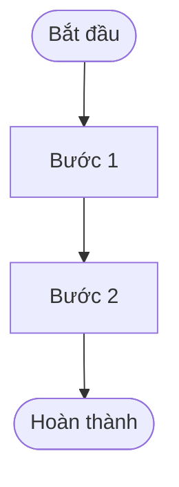

# MẪU PHIẾU YÊU CẦU PHÁT TRIỂN ỨNG DỤNG (NVG STANDARD APPLICATION REQUIREMENT TEMPLATE)
> **Mã số mẫu biểu tập đoàn:** `NVG-ITD-SOP01.F01 (01- / /2025)`  
> **Tên tài liệu:** YÊU CẦU PHÁT TRIỂN ỨNG DỤNG (BUSINESS APPLICATION REQUIREMENT)  
> **Đơn vị ban hành:** Khối Công nghệ Thông tin (NVG-ITC)  
> **Áp dụng cho:** Các Khối / Phòng ban / Đơn vị thành viên trong Tập đoàn NovaGroup khi đề xuất sáng kiến hoặc yêu cầu phát triển mới / nâng cấp phần mềm.

---

# CÔNG TY CỔ PHẦN NOVAGROUP
## YÊU CẦU PHÁT TRIỂN ỨNG DỤNG
### BUSINESS APPLICATION REQUIREMENT

---

## I. THÔNG TIN CHUNG

| Thông Tin Đề Xuất | Chi Tiết | Thông Tin Tiếp Nhận | Chi Tiết |
|---|---|---|---|
| **Người yêu cầu** | [Họ và tên người đặt yêu cầu] | **Vị trí công việc** | [Chức danh / Vị trí] |
| **Phòng ban** | [Tên Phòng ban / Khối nghiệp vụ] | **Email liên hệ** | [Email nội bộ @novagroup.vn] |
| **Người Phê duyệt** | [Họ và tên Lãnh đạo phê duyệt đề xuất] | **Vị trí công việc** | [Chức vụ Lãnh đạo] |
| **Ngày yêu cầu** | [DD/MM/YYYY] | **Số yêu cầu** | [Mã số phiếu yêu cầu, vd: REQ-2026-001] |

---

## II. MÔ TẢ YÊU CẦU

### II.1 Mô tả chung (bắt buộc điền)

| Tiêu Chí | Nội Dung Đặc Tả |
|---|---|
| **Tên Ứng dụng** | [Tên hệ thống / Phân hệ phần mềm đề xuất] |
| **Nền tảng Ứng dụng** | `Web App` / `Mobile App` / `Cả hai` |
| **Mục tiêu Ứng dụng** | [Mục tiêu nghiệp vụ cần đạt được, giải quyết vấn đề gì] |
| **Phạm vi áp dụng Ứng dụng** | [Toàn Tập Đoàn / Khối / Đơn vị thành viên cụ thể] |
| **Thời gian mong muốn hoàn thành** | [Mốc thời gian kỳ vọng Golive / Nghiệm thu] |
| **Ngân sách dự kiến** | `Có` / `Không` |
| **Nguồn ngân sách dự kiến** | [Ngân sách dự án / Ngân sách OPEX khối / ...] |
| **Chịu trách nhiệm kiểm thử (UAT)** | [Tên Ban / Phòng ban chủ trì kiểm thử UAT] |
| **Chịu trách nhiệm nghiệm thu Ứng dụng**| [Ban / Khối nghiệp vụ, Khối CNTT (ITC)] |

---

### II.2 Yêu cầu nghiệp vụ (bắt buộc điền)

#### a. Phòng ban / vị trí tham gia luồng nghiệp vụ
* **[Tên Khối / Ban]:**
  * *+ Phòng ban 1:* [Người phụ trách & Vai trò trong luồng]
  * *+ Phòng ban 2:* [Người phụ trách & Vai trò trong luồng]
* **Khối Công nghệ Thông tin (ITC):**
  * *+ Đội ngũ BA / PMO:* [Chịu trách nhiệm đặc tả & điều phối]
  * *+ Đội ngũ Kỹ thuật Dev/QA:* [Chịu trách nhiệm triển khai]

#### b. Quy trình nghiệp vụ hiện tại (As-is)
- Mô tả chi tiết hiện trạng đang vận hành thủ công (qua Excel, Google Sheet, Zalo, ký giấy tờ).
- Các điểm nghẽn, rủi ro, sai sót và lãng phí thời gian của quy trình As-is.

#### c. Quy trình nghiệp vụ tương lai (To-be)
- Liệt kê các quy trình nghiệp vụ được số hóa và áp dụng tự động hóa.
- Mô tả dòng chảy thông tin To-be sau khi có hệ thống mới.

---

### II.3 Yêu cầu nghiệp vụ - chức năng

#### A. Yêu cầu chung
* Đăng nhập tập trung qua hệ thống Single Sign-On (SSO MS Entra ID) theo email nhân viên.
* Tự động phân quyền và giới hạn phạm vi dữ liệu theo Ma trận AM (Approval Matrix).

#### B. Yêu cầu nghiệp vụ chi tiết

##### 1. Quy trình nghiệp vụ 1: [Tên quy trình]
* **Sơ đồ quy trình (Workflow Diagram):**

* **Bảng chi tiết các bước trong quy trình:**

| STT | Bước trong quy trình | Đối tượng sử dụng | Mô tả hành động | Ghi chú & Quy tắc |
|:---:|---|---|---|---|
| 1 | [Tên bước 1] | [Vai trò thực hiện] | [Mô tả chi tiết thao tác] | [Ràng buộc nghiệp vụ] |
| 2 | [Tên bước 2] | [Vai trò thực hiện] | [Mô tả chi tiết thao tác] | [Ràng buộc nghiệp vụ] |

##### 2. Quy trình nghiệp vụ 2: [Tên quy trình]
*(Trình bày tương tự quy trình 1)*

#### C. Yêu cầu chức năng
1. **Đăng nhập & Xác thực:** Đăng nhập SSO theo email nhân viên, không sử dụng tài khoản cục bộ (Zero Local Auth).
2. **Quản lý Danh mục & Cấu hình:** [Mô tả các chức năng quản lý danh mục].
3. **Nghiệp vụ Xử lý Chính:** [Mô tả chi tiết các màn hình nghiệp vụ chính].
4. **Luồng Phê duyệt:** Cấu hình phê duyệt đa cấp theo Ma trận AM.

#### D. Biểu mẫu - Báo cáo thống kê
1. **Biểu mẫu nghiệp vụ:**
   * Liệt kê các mẫu in, chứng từ cần xuất từ hệ thống (PDF, Excel, Word).
   * Mẫu biểu đính kèm theo quy chuẩn Tập đoàn.
2. **Báo cáo thống kê:**
   * Yêu cầu về Dashboard quản trị, biểu đồ trực quan, các chỉ số KPI theo dõi thời gian thực.
   * Danh sách mẫu báo cáo số liệu chi tiết cần kết xuất.

---

### II.4 Yêu cầu giao diện người dùng (UI/UX)
* Mô tả phong cách giao diện mong muốn, màu sắc nhận diện thương hiệu.
* Sơ đồ mặt bằng, thẻ phân màu trạng thái, Kanban Board (nếu có).

### II.5 Yêu cầu tích hợp (nếu có)
* **Liên kết hệ thống:** Liệt kê các hệ thống vệ tinh cần kết nối (FAST Kế toán, SAP, CRM, HR Portal...).
* **Phương thức tích hợp:** API RESTful, Message Queue, Batch File.

### II.6 Yêu cầu phi chức năng
* **Bảo mật:** Tuân thủ tiêu chuẩn an toàn thông tin của Tập đoàn NovaGroup, phân quyền chặt chẽ theo Ma trận AM.
* **Hiệu năng & Tải:** Thời gian phản hồi trang $\le 2$ giây; đáp ứng lượng người dùng đồng thời.
* **Lưu vết (Audit Trail):** Toàn bộ giao dịch thay đổi dữ liệu phải lưu lịch sử người sửa và thời gian máy chủ; tuân thủ xóa mềm 100% (`deletedAt`).

---

## III. THÔNG TIN KHÁC (nếu có)

### CÁC CẤP ĐỀ XUẤT (SUBMITTED BY)

| Cấp Đề Xuất | Ngày Ký | Họ và Tên | Chức Vụ | Chữ Ký Xác Nhận |
|---|:---:|---|---|:---:|
| **Người lập phiếu** | ……/……/2026 | [Họ tên] | [Chức vụ chuyên viên] | |
| **Trưởng Bộ phận** | ……/……/2026 | [Họ tên] | [Chức vụ Trưởng phòng] | |
| **Giám đốc Khối / Đơn vị** | ……/……/2026 | [Họ tên] | [Chức vụ Giám đốc] | |

### CẤP PHÊ DUYỆT (APPROVED BY)

| Cấp Phê Duyệt | Ngày Ký | Họ và Tên | Chức Vụ | Chữ Ký Phê Duyệt |
|---|:---:|---|---|:---:|
| **Lãnh đạo Khối CNTT (ITC)** | ……/……/2026 | [Họ tên] | Giám đốc Khối CNTT / GĐ CĐS | |
| **Ban Điều Hành Tập Đoàn** | ……/……/2026 | [Họ tên] | Phó Tổng Giám Đốc / TGĐ | |
